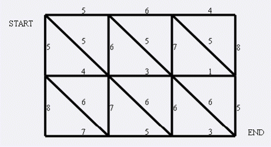

# #1001. [BeiJing2006]狼抓兔子

内存限制：162 MiB时间限制：15 Sec

## 题目描述

现在小朋友们最喜欢的"喜羊羊与灰太狼",话说灰太狼抓羊不到，但抓兔子还是比较在行的，

而且现在的兔子还比较笨，它们只有两个窝，现在你做为狼王，面对下面这样一个网格的地形：

 

左上角点为(1,1),右下角点为(N,M)(上图中N=4,M=5).有以下三种类型的道路 

1:(x,y)<==>(x+1,y) 

2:(x,y)<==>(x,y+1) 

3:(x,y)<==>(x+1,y+1) 

道路上的权值表示这条路上最多能够通过的兔子数，道路是无向的. 左上角和右下角为兔子的两个窝，

开始时所有的兔子都聚集在左上角(1,1)的窝里，现在它们要跑到右下解(N,M)的窝中去，狼王开始伏击

这些兔子.当然为了保险起见，如果一条道路上最多通过的兔子数为K，狼王需要安排同样数量的K只狼，

才能完全封锁这条道路，你需要帮助狼王安排一个伏击方案，使得在将兔子一网打尽的前提下，参与的

狼的数量要最小。因为狼还要去找喜羊羊麻烦.

## 输入格式

第一行为N,M.表示网格的大小，N,M均小于等于1000.

接下来分三部分

第一部分共N行，每行M-1个数，表示横向道路的权值. 

第二部分共N-1行，每行M个数，表示纵向道路的权值. 

第三部分共N-1行，每行M-1个数，表示斜向道路的权值. 

输入文件保证不超过10M

## 输出格式

输出一个整数，表示参与伏击的狼的最小数量. 

## 样例

### 样例输入

    
    3 4
    5 6 4
    4 3 1
    7 5 3
    5 6 7 8
    8 7 6 5
    5 5 5
    6 6 6
    

### 样例输出

    
    14
    

## 数据范围与提示

 2015.4.16新加数据一组，可能会卡掉从前可以过的程序。
