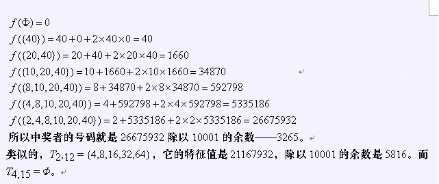

# #1144. [CTSC2008]奥运抽奖volunteer

内存限制：259 MiB时间限制：30 Sec

## 题目描述

　　距2008年北京奥运会开幕还有90天时，CTSC准备为志愿者们举行一次抽奖活动。作为志愿者的一员，你对这次

抽奖活动自然是万分期待。 CTSC委员会介绍了抽奖活动的规则。设总共有p个参加抽奖的志愿者，开始时每一个志

愿者领取一个0到p-1的 号码。任意两个志愿者领取的号码不同。屏幕的正中央是五福娃的头像，他们不停的眨眼

欢迎大家。开始抽奖时，工作人员按下屏幕旁边的按钮，等待屏幕上的画面静止下来。这时，福娃们都停止眨眼了

。当然，画面静止时，有的福娃的眼睛可能是睁开的，有的是闭上的。如果所有福娃的眼睛都闭上了，工作人员需

要重新按一 下按钮。这样，直到至少有一个福娃的眼睛是睁开的。接着，工作人员开始观察有哪些福娃的眼睛是

睁开的。工作人员对五个福娃都标了号。贝贝、晶晶、欢欢、迎迎、妮妮的标号分别是2、3、4、5、6（工作人员

认为0和1都不是好数字）。定义幸运数字如下： 1、如果一个福娃的眼睛是睁开的，那么他（她）对应的标号就是

幸运数字； 2、如果数字l1和l2(可能相等)都是幸运数字，那么他们的乘积 也是幸运数字； 3、其他的数字都不

是幸运数字。 用L表示所有数字的集合，例如，如果贝贝、晶晶的眼睛是睁开的，欢欢、迎迎、妮妮的眼睛是闭上

的，则L={2,3,4,6,8,9,12,&hellip;}。令l(x)表示第x大的幸运数字。例如，上面的例子中，l(1)=2，l(4)=6等等。 接

着，工作人员开始随机产生两个数，小的数是a，大的数字是b。定义集合T(a,b)为：

 

　　（其中 表示x整除y） 定义一个自然数的有限子集的特征值f 如下： 1、空集的特征值为0，即 ； 2、对于非

空集合S，令d为S中的最小元素，则

 

　　其中， 表示把S删除元素d后的集合，q是一个给定的非负整数。在a和b产生以后，中奖的志愿者就确定了，他

的号码是 除以p的余数。工作人员会产生多次a，b，这样就能形成多个中奖者。但是，抽奖现场的程序需要很长的

时间才能算出中奖的志愿者。出于对中奖结果的热切期待，你便想要重新写一下计算程序，于是，你的目光移向了

前面的键盘&hellip;&hellip;。

## 输入格式

输入的第一行给出用空格隔开的5个数

每个数不是0就是1，分别表示贝贝、晶晶、欢欢、迎迎、妮妮的眼睛是否睁开。

0对应眼睛闭上，1对应眼睛睁开。5个数不可能都是0。

第二行给出了用空格隔开的两个数，p和q。

其中p表示参加抽奖的志愿者的人数，q如前所述，用来计算集合的特征值。

第三行给出了数n，表示抽取的a和b的次数。

接下来的n行，每一行有两个数a、b，中间用空格隔开，表示一次抽奖产生的两个数。

## 输出格式

输出共n行，每一行一个整数，表示一次抽奖中中奖者的号码。

顺序与输入的n对a、b一一对应。当然，一个人可能中奖多次。

## 样例

### 样例输入

    
    1 0 0 1 0
    10001 2
    3
    1 10
    2 12
    4 15
    

### 样例输出

    
    3265
    5816
    0
    

## 数据范围与提示

