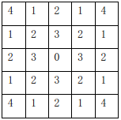

# #1193. [HNOI2006]马步距离

内存限制：162 MiB时间限制：10 Sec

## 题目描述

在国际象棋和中国象棋中，马的移动规则相同，都是走&ldquo;日&rdquo;字，我们将这种移动方式称为马步移动。如图所示，

从标号为 0 的点出发，可以经过一步马步移动达到标号为 1 的点，经过两步马步移动达到标号为 2 的点。任给

平面上的两点 p 和 s ,它们的坐标分别为 (xp,yp) 和 (xs,ys) ,其中，xp，yp，xs，ys 均为整数。从 (xp,yp) 

出发经过一步马步移动可以达到 (xp+1,yp+2)、(xp+2,yp+1)、(xp+1,yp-2)、(xp+2,yp-1)、(xp-1,yp+2)、(xp-2,

yp+1)、(xp-1,yp-2)、(xp-2,yp-1)。假设棋盘充分大，并且坐标可以为负数。现在请你求出从点 p 到点 s 至少

需要经过多少次马步移动？

## 输入格式

只包含4个整数，它们彼此用空格隔开，分别为xp,yp,xs,ys。并且它们的都小于10000000。

## 输出格式

含一个整数，表示从点p到点s至少需要经过的马步移动次数。

## 样例

### 样例输入

    
    1 2 7 9
    

### 样例输出

    
    5
    

## 数据范围与提示
