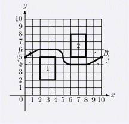

# #1284. Neerc2006 Driving Directions

内存限制：162 MiB时间限制：10 Sec

## 题目描述

在平面上有n个平行于坐标轴的矩形障碍物, 现需要将一个半径为r的圆从A点移动到B点. 请计算最短路. (n <= 30) 

## 输入格式

本题是多组数据，第一行一个整数T(T<=30)表示数据组数，接下来依次描述每一组数据，每组数据第一行两个整数r,n(1<=r<=100,0<=n<=30)如上所述。第二行包含4个整数xA,yA,xB,yB，(xA,yA)表示起点A坐标，(xB,yB)表示终点B坐标。接下来n行每行4个整数x1,y1,x2,y2，(x1,y1)表示矩形障碍物左下角坐标，(x2,y2)表示矩形障碍物右上角坐标。 矩形不会互相覆盖或接触，起点的坐标是合法的，即一开始不会与任何矩形相交（但是可能和某些矩形相切）

## 输出格式

每组数据输出一行，一个实数，输出保留6位小数，即从A到B不穿过矩形的最短路，如果不存在最短路请输出no solution。

## 样例

### 样例输入

    
    1
    1 3
    2 7 7 1
    3 2 6 4
    7 5 9 8
    1 8 5 9
    
    
    

### 样例输出

    
    10.570796
    
    

## 数据范围与提示
