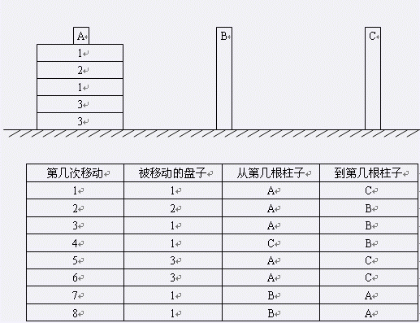

# #1289. [CTSC2009]移盘子

内存限制：162 MiB时间限制：30 Sec

## 题目描述

已知有三根柱子，分别记为A，B和C。初始状态时A上放有N个盘子，而B和C两个柱子上没有放任何盘子。你每次能做的移动操作就是把某根柱子最上面的一个盘子拿下来，然后放到另一个柱子上。盘子有三类，分别用1，2，3来表示。你的目标是，让所有1类盘子最终放在A上，让所有2类盘子最终放在B上，所有3类盘子最终放在C上。现在让你求出实现上述目标总共最少需要多少次移动？

## 输入格式

第一行包含一个整数N，为盘子的总数。第二行有N个数，每个数只能是1，2，3之一。这N个数表示在初始状态时第一个柱子上所有盘子的类型，按照从上往下的顺序。

## 输出格式

只包含一个数，即最少的移动次数。

## 样例

### 样例输入

    
    5
    1 2 1 3 3
    
    

### 样例输出

    
    8
    
    

## 数据范围与提示

 

对于100%的数据，N &le; 1000
