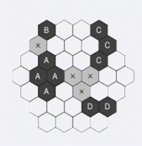

# #1401. Hexagon

内存限制：64 MiB时间限制：3 Sec

## 题目描述

A civil engineer that has recently graduated from the Czech Technical University encountered an interesting problem and asked us for a help. The problem is more of economical than engineering nature. The engineer needs to connect several buildings with an infrastructure. Unfortunately, the investor is not the owner of all the land between these places. Therefore, some properties have to be bought first. The land is divided into a regular ``grid" of hexagonal parcels, each of them forms an independent unit and has the same value. Some of the parcels belong to the investor. These parcels form four connected areas, each containing one building to be connected with the others. Your task is to find the minimal number of parcels that must be acquired to connect the four given areas. The whole land also has a hexagonal shape with six sides, each consisting of exactly H parcels. The above picture shows a land with H = 4 , parcels with letters represent the four areas to be connected. In this case, it is necessary to buy four additional parcels. One of the possible solutions is marked by crosses.

&ldquo;话说有一天下流星雨，天上掉下来一个玉佩，它拥有无穷的力量。不过由于进入大气层的时候受到过于大的压力而导致被分成了4个部分散落在人间&hellip;&hellip;&rdquo;

春哥对你说了这个传说，你抱着&ldquo;信春鸽，得永生&rdquo;的信念来到了这块散落着的玉佩的土地上。

这是一块正六边形的土地，到达的时候你发现了它已经变成了4个部分分散在各个角落。经过探索你发现了这个玉佩只有把4块全部连到一起的时候才会发出无穷的力量，但是由于某种因素和技术原因，我们并不能移动任意一个玉佩的部分，只能通过购买一种连接用材料铺盖在土地上，把它们全部连在一起才行。

现在需要找到最少要多少钱才可以得到这无穷的力量。

 

比如说下图（见hint），玉佩被分成了4个部分ABCD，最少需要铺盖4块土地（用x标出）就可以把它们全部连接起来。

## 输入格式

The input contains several scenarios. Each scenario begins with an integer number H , which specifies the size of the land, 2 H 20 . Then there are 2*H - 1 lines representing individual ``rows" of the land (always oriented as in the picture). The lines contain one non-space character for each parcel. It means the first line will contain H characters, the second line H + 1 , and so on. The longest line will be the middle one, with 2*H - 1 characters. Then the ``length" descends and the last line contains H parcels, again. The character representing a parcel will be either a dot (``.") for the land that is not owned by the investor, or one of the uppercase letters ``A", ``B", ``C", or ``D". The areas of parcels occupied by the same letter will always be connected. It means that between any two parcels in the same area, there exists a path leading only through that area. Beside the characters representing parcels, the lines may contain any number of spaces at any positions to improve ``human readability" of the input. There is always at least one space between two letters (or the dots). After the land description, there will be one empty line and then the next scenario begins. The last scenario is followed by a line containing zero. 

## 输出格式

For each scenario, output one line with the sentence ``You have to buy P parcels.", where P is the minimal number of parcels that must be acquired to make all four areas connected together. Areas are considered connected, if it is possible to find a path between them that leads only through parcels that have been bought. 

## 样例

### 样例输入

    
    4 
        B . . C 
       . . . . C 
      . A . . C . 
     . A A . . . .
      . A . . . . 
       . . . D D 
        . . . . 
    0
    
    

### 样例输出

    
    You have to buy 4 parcels.
    
    

## 数据范围与提示

