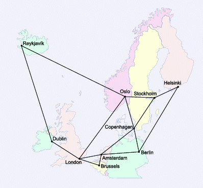

# #1402. Ticket to Ride

内存限制：64 MiB时间限制：5 Sec

## 题目描述

给一张地图，地图上有一些城市，城市之间可能有线路连通，我们用一个无向图来表示以简化概念，每条边有个权值，表示选择这条边需要花费的费用。给定4对顶点(可能重复)，求一个权值最小的边集，使得任意一对顶点可以由选出的边集中的边相连。
按照惯例，下面给出一个例子：

## 输入格式

第1行2个整数，n和m，分别表示城市的个数和边的个数。
接下来n行，每行一个字符串，表示每个城市的名字。城市的名字为一个不超过20个字符，由小写字母构成的字符串。
再接下来m行，每行给出s1,s2和w，其中s1,s2为城市的名字，w为他们之间边的权值。
最后，给出4行，每行给出两个字符串，分别为要求的一对城市的名字。

## 输出格式

一行，输出最小的花费。

## 样例

### 样例输入

    
    样例输入1：
    10 15
    stockholm
    amsterdam
    london
    berlin
    copenhagen
    oslo
    helsinki
    dublin
    reykjavik
    brussels
    oslo stockholm 415
    stockholm helsinki 396
    oslo london 1153
    oslo copenhagen 485
    stockholm copenhagen 522
    copenhagen berlin 354
    copenhagen amsterdam 622
    helsinki berlin 1107
    london amsterdam 356
    berlin amsterdam 575
    london dublin 463
    reykjavik dublin 1498
    reykjavik oslo 1748
    london brussels 318
    brussels amsterdam 173
    stockholm amsterdam
    oslo london
    reykjavik dublin
    brussels helsinki
    
    样例输入2：
    2 1
    first
    second
    first second 10
    first first
    first first
    second first
    first first
    
    
    

### 样例输出

    
    样例输出1：
    3907
    
    样例输出2：
    10
    
    数据范围：
    n
    

## 数据范围与提示
