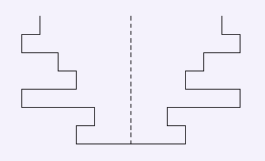
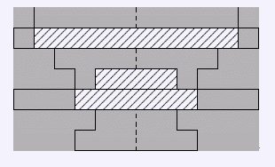

# #1510. [POI2006]Kra-The Disks

内存限制：64 MiB时间限制：5 Sec

## 题目描述

Johnny 在生日时收到了一件特殊的礼物，这件礼物由一个奇形怪状的管子和一些盘子组成. 这个管子是由许多不同直径的圆筒(直径也可以相同) 同轴连接而成. 这个管子的底部是封闭的,顶部是打开的. 下图是由直径为: 5cm, 6cm, 4cm, 3cm, 6cm, 2cm and 3cm 的圆筒组成的管子. 

每个圆筒的高度都是相等的, 玩具中所带的盘子也是一些高度和它们相同的圆筒,直径有大有小. 
Johnny 发明了一种游戏,把盘子从管子顶部一个接一个的扔下去,他想知道最后这些盘子落在了哪,假设盘子落下过程中圆心和管子的轴一直保持一致,比如说我们丢下去三个盘子: 3cm, 2cm and 5cm, 下图展示了最终它们的停止位置: 

如图可以知道,盘子掉下去以后,要么被某个圆筒卡住,要么就是因为掉在了以前的一个盘子上而停住. 
Johnny 想知道他最后扔下去的那个盘子掉在了哪个位置,你来帮他把. 

## 输入格式

第一行两个整数 n 和 m ( 1

## 输出格式

一个整数输出最后一个盘子掉在了哪一层,如果盘子不能扔进水管,那么打印0. 

## 样例

### 样例输入

    
    7 3
    5 6 4 3 6 2 3
    3 2 5
    
    

### 样例输出

    
    2
    
    

## 数据范围与提示
