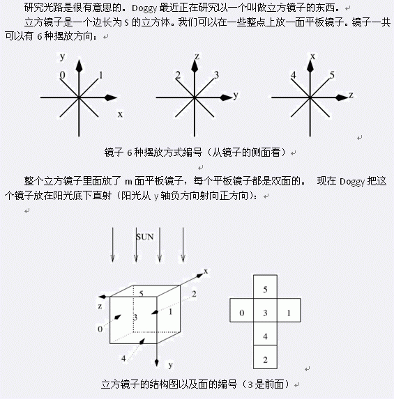

# #1544. 立方镜子

内存限制：64 MiB时间限制：10 Sec

## 题目描述

 
我们只考虑射向整点的光线，那么这样的光线一共有(s+1)*(s+1)条。这些光线经过一系列平板镜子的反射（如果没有镜子阻挡也是可能直接射穿的）之后最终会从立方镜子的某个面出来（上图已经将面编号，并给定坐标轴方向）。现在你的任务就是求每个面出来的光线条数以及这些光线的反射次数和。

## 输入格式

第一行s,为立方镜子的边长。(1

## 输出格式

共6组，每组两行，按顺序分别输出从面0到面5的出射光线条数，以及这部分光线的总反射次数。

## 样例

### 样例输入

    
    5
    4
    4 4 0 0
    1 3 0 1
    1 1 0 0
    4 1 0 1
    
    
    

### 样例输出

    
    0
    0
    0
    0
    1
    1
    1
    1
    34
    0
    0
    0
    
    
    

## 数据范围与提示

注：我们认为每个平板镜子都是无限薄的，即如果有一束光线从一个镜子的侧面射入，它会方向不变的射出。
样例解释：
2号面射出去了一根光线：从(4,0,0)落下击中(4,1,0)处的镜子然后射出去。反射次数为1
3号面射出去了一根光线：从(1,0,0)落下击中(1,1,0)处的镜子然后射出去。反射次数为1
剩余的的36-2=34条光线没有经过任何反射直接从4号面射出。
(1,3,0)处的镜子与(4,4,0)处的镜子没被用到。

