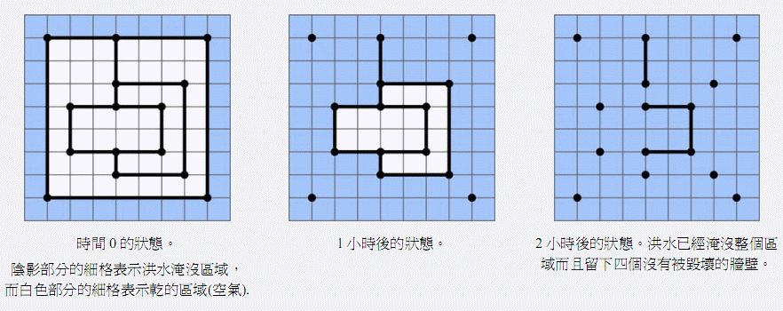

# #1804. [Ioi2007]Flood 洪水

内存限制：64 MiB时间限制：10 Sec

## 题目描述

1964年的一场灾难性的洪水冲毁了萨格热布城。洪水袭来时许多建筑的墙被彻底冲毁。在这个题目中，给定了城市在洪水来袭前的简化模型，你的任务是确定洪水过后哪些墙没有被冲毁。

简化模型由平面上的N个点和W堵墙构成。每堵墙连接两个点，没有任何一堵墙通过其它点。模型具有如下性质：
&#8226; 不存在两堵墙相交或者重合的情况，但是两堵墙可以在端点相连；
&#8226; 每堵墙或者平行于坐标系的横轴，或者平行于坐标系的纵轴。

最开始，整个坐标平面都是干的。在零时刻，洪水将城市的外围淹没（城市的外围是指没有被墙围起来的区域）。一个小时之后，所有一边是水，一边是空气的墙在水的压力下都会倒塌。于是洪水又会吞没那些没有被完好的墙围住的区域。接下来又有一些墙面临一边是水一边是空气，将要被洪水冲毁的局面。又过了一个小时，这些墙也被冲毁了。这样的过程不断重复，直到洪水淹没整个城市。

下图给出了洪水侵袭过程的一个例子。

 
      
(图一)在零时刻，阴影的格子代表洪水区域，白色的格子代表干的区域（有空气的区域）。(图二) 一个小时之后的情况。(图三)两个小时之后，洪水淹没了整个城市，有4堵墙没有被冲毁而留了下来。

 

任务

给定N个点的坐标和连接这些点的W堵墙的描述，编程确定洪水过后，哪些墙会被留下来。

## 输入格式

输入的第一行包含一个整数N(2 ≤ N ≤ 100 000), 表示平面上的点的个数。
接下来的N行每行包含两个整数X和Y（都是0到1 000 000之间（包括0和1 000 000）的整数），表示点的坐标。所有点按照它们被给出的顺序编号为1到N。没有两个点在同一位置上。
接下来一行包含一个整数W(1 ≤ W ≤ 2N)，表示墙的数目。
接下来W行每行包含两个不同的整数A和B(1≤ A ≤ N, 1 ≤ B ≤ N)，表示在洪水到来前，有一堵墙连接A和B。这些墙按照它们被给出的顺序编号为1到W。

## 输出格式

输出的第一行包含一个整数K，表示洪水过后留下的墙的数目。

评分

有40分的测试样例，所有坐标小于等于500。
在上面的样例和另外15分的样例中，点的个数不超过500个。
中将给出一个评测结果的总结。

## 样例

### 样例输入

    
    15
    1 1
    8 1
    4 2
    7 2
    2 3
    4 3
    6 3
    2 5
    4 5
    6 5
    4 6
    7 6
    1 8
    4 8
    8 8
    17
    1 2
    2 15
    15 14
    14 13
    13 1
    14 11
    11 12
    12 4
    4 3
    3 6
    6 5
    5 8
    8 9
    9 11
    9 10
    10 7
    7 6
    
    

### 样例输出

    
    4
    
    

## 数据范围与提示

这个样例对应前页图中的例子。
