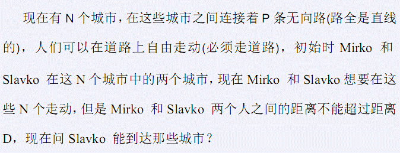

# #1885. [Coi2003]Locomotive

内存限制：64 MiB时间限制：1 Sec

## 题目描述

## 输入格式

The first line of the input file contains the numbers N and P, and
a real number D, 2 ≤ N ≤ 100, 1 ≤ P ≤ 3000, 1 ≤ D ≤ 10,000.
The number N is the number of towns, the number P is the number of
railroads, and D is the range of the radio in kilometers (a decimal 
number two digits precise). The towns are numbered 1 to N. Each of
the following N lines contains data describing one town, i.e. two
integers, X and Y, -5000 ≤ X, Y ≤ 5000, representing the town ’ s
coordinates.
Each of the following P lines contains data describing one railroad
track, i.e. two integers G1 and G2, saying there is a railroad
rack connecting G1 i G2.
The next line contains the starting positions of Mirko and Slavku,
the integers U and V. Mirko starts from town U, Slavko from town V.
U and V will represent two towns separated at most D kilometers
in distance.

## 输出格式

The output file should contain the numbers of all the towns Slavko
can reach. These numbers should be sorted in increasing order, each of
them written on a separate line.

## 样例

### 样例输入

    
    5 4 1.5
    0 1
    0 0
    4 1
    4 0
    2 2
    1 3
    1 5
    3 5
    2 4
    2 1
    

### 样例输出

    
    1
    3
    

## 数据范围与提示
