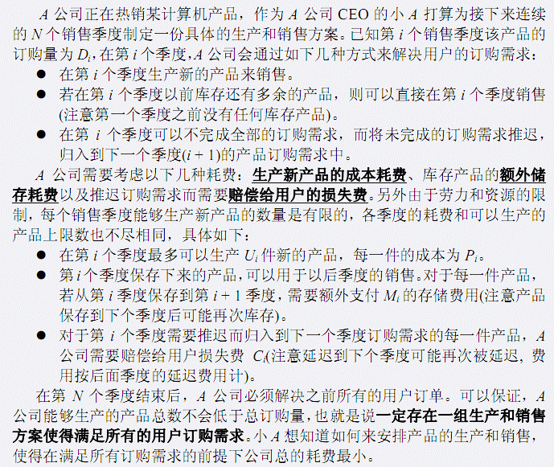
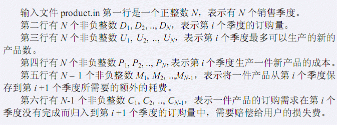

# #1920. [Ctsc2010]产品销售

内存限制：259 MiB时间限制：20 Sec

## 题目描述

## 输入格式

## 输出格式

仅包含一个非负整数，表示公司的最小总耗费。

## 样例

### 样例输入

    
    4 
    3 2 1 2 
    2 5 2 2 
    5 1 5 5 
    1 2 1  
    5 3 3 
    

### 样例输出

    
    30
    

## 数据范围与提示

第一个季度生产 2件产品，第二个季度生产5 件产品，第三个季度不生产产
品，第四个季度生产 1 件产品，成本为 2 * 5 + 5 * 1 + 0 * 5 + 1 * 5 = 20。 
因为第一个季度最多只能生产 2 件产品，无法满足 3 件的订购量，因此将 1
件产品的订购量推迟到第二个季度，赔偿给用户的损失费为 5。 
第二个季度由于第一个季度推迟了一件产品的订购需求， 因而订购量变为 3。
该季度生产了5件产品， 剩下的2件保存下来。 第三个季度直接销售库存的产品，
再多出来的 1 件产品继续储存到第四个季度，加上第四个季度生产了 1 件产品，
因此满足了所有订单需求。总的储存费用为 2 * 2 + 1 * 1 = 5。 
总的费用为 20 + 5 + 5 = 30。 
 
对于 30%的数据，N&#3409;< = 1,000。 
对于 100%的数据，1  < =&#3409;N < =&#3409; 100,000，1< =&#3409;Di, Ui, Pi, Mi,Ci < =&#3409; 10,000。 
