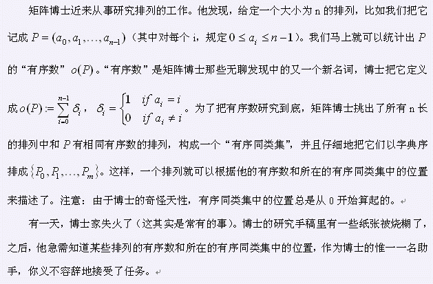

[Shoi2007]Permutation 有序的计数

# #1931. [Shoi2007]Permutation 有序的计数

内存限制：64 MiB时间限制：1 Sec

## 题目描述

## 输入格式

文件的第一行只有一个整数n（1≤n≤64），代表给定排列的长度。文件的第二行开始有n个整数，顺次代表一个排列，注意是排列中的元素是从0开始到n-1的。

## 输出格式

只有一行，输出两个整数，第一个整数代表给定排列的有序数，第二个整数代表它所在的有序同类集中的位置。

## 样例

### 样例输入

    
    4
    2 0 3 1
    
    

### 样例输出

    
    0 3
    
    

## 数据范围与提示

对于40%的数据，n ≤ 10。
对于100%的数据，n ≤ 64。
