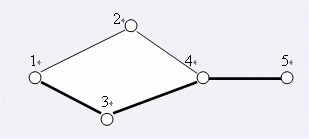

# #1969. [Ahoi2005]LANE 航线规划

内存限制：64 MiB时间限制：10 Sec

## 题目描述

对Samuel星球的探险已经取得了非常巨大的成就，于是科学家们将目光投向了Samuel星球所在的星系——一个巨大的由千百万星球构成的Samuel星系。
星际空间站的Samuel II巨型计算机经过长期探测，已经锁定了Samuel星系中许多星球的空间坐标，并对这些星球从1开始编号1、2、3……。
一些先遣飞船已经出发，在星球之间开辟探险航线。
探险航线是双向的，例如从1号星球到3号星球开辟探险航线，那么从3号星球到1号星球也可以使用这条航线。
例如下图所示：
 
在5个星球之间，有5条探险航线。
A、B两星球之间，如果某条航线不存在，就无法从A星球抵达B星球，我们则称这条航线为关键航线。
显然上图中，1号与5号星球之间的关键航线有1条：即为4-5航线。
然而，在宇宙中一些未知的磁暴和行星的冲撞，使得已有的某些航线被破坏，随着越来越多的航线被破坏，探险飞船又不能及时回复这些航线，可见两个星球之间的关键航线会越来越多。
假设在上图中，航线4-2（从4号星球到2号星球）被破坏。此时，1号与5号星球之间的关键航线就有3条：1-3，3-4，4-5。
小联的任务是，不断关注航线被破坏的情况，并随时给出两个星球之间的关键航线数目。现在请你帮助完成。

## 输入格式

第一行有两个整数N，M。表示有N个星球（1< N < 30000），初始时已经有M条航线（1 < M < 100000）。随后有M行，每行有两个不相同的整数A、B表示在星球A与B之间存在一条航线。接下来每行有三个整数C、A、B。C为1表示询问当前星球A和星球B之间有多少条关键航线；C为0表示在星球A和星球B之间的航线被破坏，当后面再遇到C为1的情况时，表示询问航线被破坏后，关键路径的情况，且航线破坏后不可恢复； C为-1表示输入文件结束，这时该行没有A,B的值。被破坏的航线数目与询问的次数总和不超过40000。

## 输出格式

对每个C为1的询问，输出一行一个整数表示关键航线数目。

注意：我们保证无论航线如何被破坏，任意时刻任意两个星球都能够相互到达。在整个数据中，任意两个星球之间最多只可能存在一条直接的航线。

## 样例

### 样例输入

    
    5 5
    1 2
    1 3
    3 4
    4 5
    4 2
    1 1 5
    0 4 2
    1 5 1
    -1
    
    
    

### 样例输出

    
    1
    3
    
    

## 数据范围与提示
