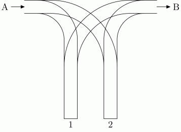

# #2080. [Poi2010]Railway

内存限制：259 MiB时间限制：10 Sec

## 题目描述

一个铁路包含两个侧线1和2，右边由A进入，左边由B出去（看下面的图片）

有n个车厢在通道A上，编号为1到n，它们被安排按照要求的顺序（a1,a2,a3,a4....an）进入侧线，进去还要出来，它们要按照编号顺序（1，2，3，4，5。。。。n）从通道B出去。他们从A到1或2，然后经过一系列转移从B出去，不用考虑容量问题。

## 输入格式

输入：第一行一个整数n（1<=n<=100000）表示要转移的车厢总数，第二行为进入侧线的要求顺序a1.a2.a3.a4....an，由空格隔开。

## 输出格式

输出：如果可以按照编号顺序到通道B，则输出两行，第一行为TAK，第二行为n个由空格隔开的整数，表示每个车厢进入的侧线编号（1,2）。否则输出NIE。要求输出字典序最小的方案

## 样例

### 样例输入

    
    [样例输入1]
    4
    1 3 4 2
    [样例输入2]
    4
    2 3 4 1
    

### 样例输出

    
    [样例输出1]
    TAK
    1 1 2 1        （1号线进到侧线1，然后出来，3号进入侧线1,4号进入侧线2,2号进入侧线1，然后出来，接着3号出来，4号出来）
    [样例输出2]
    NIE            （不可能。。No）
    

## 数据范围与提示
