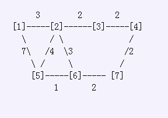

# #2100. [Usaco2010 Dec]Apple Delivery

内存限制：64 MiB时间限制：10 Sec

## 题目描述

Bessie has two crisp red apples to deliver to two of her friends in the herd. Of course, she travels the C (1 <= C <= 200,000) cowpaths which are arranged as the usual graph which connects P (1 <= P <= 100,000) pastures conveniently numbered from 1..P: no cowpath leads from a pasture to itself, cowpaths are bidirectional, each cowpath has an associated distance, and, best of all, it is always possible to get from any pasture to any other pasture. Each cowpath connects two differing pastures P1_i (1 <= P1_i <= P) and P2_i (1 <= P2_i <= P) with a distance between them of D_i. The sum of all the distances D_i does not exceed 2,000,000,000. What is the minimum total distance Bessie must travel to deliver both apples by starting at pasture PB (1 <= PB <= P) and visiting pastures PA1 (1 <= PA1 <= P) and PA2 (1 <= PA2 <= P) in any order. All three of these pastures are distinct, of course. Consider this map of bracketed pasture numbers and cowpaths with distances:  If Bessie starts at pasture [5] and delivers apples to pastures [1] and [4], her best path is: 5 -> 6-> 7 -> 4* -> 3 -> 2 -> 1* with a total distance of 12.

一张P个点的无向图，C条正权路。
CLJ要从Pb点（家）出发，既要去Pa1点NOI赛场拿金牌，也要去Pa2点CMO赛场拿金牌。（途中不必回家）
可以先去NOI，也可以先去CMO。
当然神犇CLJ肯定会使总路程最小，输出最小值。

## 输入格式

* Line 1: Line 1 contains five space-separated integers: C, P, PB, PA1, and PA2 * Lines 2..C+1: Line i+1 describes cowpath i by naming two pastures it connects and the distance between them: P1_i, P2_i, D_i

## 输出格式

* Line 1: The shortest distance Bessie must travel to deliver both apples

## 样例

### 样例输入

    
    9 7 5 1 4
    5 1 7
    6 7 2
    4 7 2
    5 6 1
    5 2 4
    4 3 2
    1 2 3
    3 2 2
    2 6 3
    
    
    
    
    

### 样例输出

    
    12
    
    

## 数据范围与提示

求翻译.........站内PM我吧.........
