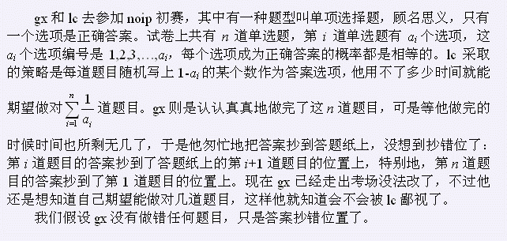

# #2134. 单选错位

内存限制：259 MiB时间限制：10 Sec

## 题目描述

## 输入格式

n很大，为了避免读入耗时太多，

输入文件只有5个整数参数n, A, B, C, a1，

由上交的程序产生数列a。

下面给出pascal/C/C++的读入语句和产生序列的语句（默认从标准输入读入）： 

// for pascal 

readln(n,A,B,C,q[1]); 

for i:=2 to n do q[i] := (int64(q[i-1]) * A + B) mod 100000001; 

for i:=1 to n do q[i] := q[i] mod C + 1; 

// for C/C++ 

scanf("%d%d%d%d%d",&n,&A,&B,&C,a+1); 

for (int i=2;i<=n;i++) a[i] = ((long long)a[i-1] * A + B) % 100000001; 

for (int i=1;i<=n;i++) a[i] = a[i] % C + 1; 

选手可以通过以上的程序语句得到n和数列a（a的元素类型是32位整数），

n和a的含义见题目描述。

 2&le;n&le;10000000, 0&le;A,B,C,a1&le;100000000

## 输出格式

输出一个实数，表示gx期望做对的题目个数，保留三位小数。

## 样例

### 样例输入

    
    3 2 0 4 1
    
    

### 样例输出

    
    1.167
    【样例说明】
    a[] = {2,3,1}
    正确答案	gx的答案	做对题目	出现概率
    {1,1,1}	{1,1,1}	3	1/6
    {1,2,1}	{1,1,2}	1	1/6
    {1,3,1}	{1,1,3}	1	1/6
    {2,1,1}	{1,2,1}	1	1/6
    {2,2,1}	{1,2,2}	1	1/6
    {2,3,1}	{1,2,3}	0	1/6
    共有6种情况，每种情况出现的概率是1/6，gx期望做对(3+1+1+1+1+0)/6 = 7/6题。（相比之下，lc随机就能期望做对11/6题）
    

## 数据范围与提示
