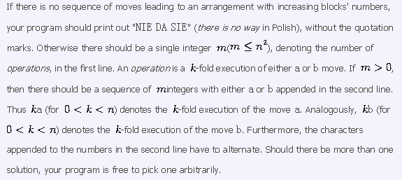

# #2214. [Poi2011]Shift

内存限制：64 MiB时间限制：10 Sec

## 题目描述

Byteasar bought his son Bytie a set of blocks numbered from to and arranged them in a row in a certain order. Bytie's goal is to rearrange the blocks so that they are ordered naturally, from the smallest number to the largest. However, the only moves Bytie is allowed to make are: putting the last block at the very beginning (move a), and putting the third block at the very beginning (move b). Help Bytie by writing a program that tells whether a given arrangement of blocks can be properly reordered, and tells the right sequence of moves if it is.

有一个1..n的排列，有两种操作：
(a) 将最后一个数移到最前面
(b) 把第三个数移到最前面

我们将连续进行k次同一个操作称为&ldquo;一块操作&rdquo;，表示为ka或kb。
找到一个操作序列使得进行这些操作后，排列变为1,2,3,...,n。

## 输入格式

In the first line of the standard input there is a single integer ,(1<=N<=2000). In the second line there are integers from the range to , separated by single spaces. No number appears twice, and thus they represent the initial arrangement of the blocks. .

第一行n(1<=n<=2000)
下面一行n个数表示这个排列。

## 输出格式

 

如果不存在这样的操作序列，输出"NIE DA SIE"，否则
第一行m，表示操作的块数。
下面一行，表示这m块操作。
需要满足相邻两块操作的种类不同，每块操作中进行的次数大于0小于n。
需要满足m<=n*n

## 样例

### 样例输入

    
    Sample Input #1
    4
    1 3 2 4
    Sample Output #1
    4
    3a 2b 2a 2b
    
    Sample Input #2
    7
    1 3 2 4 5 6 7
    Sample Output #2
    NIE DA SIE
    
    Sample Input #3
    3
    1 2 3
    Sample Output #3
    0
    
    

### 样例输出

## 数据范围与提示

鸣谢NOIGOLD vfleaking
