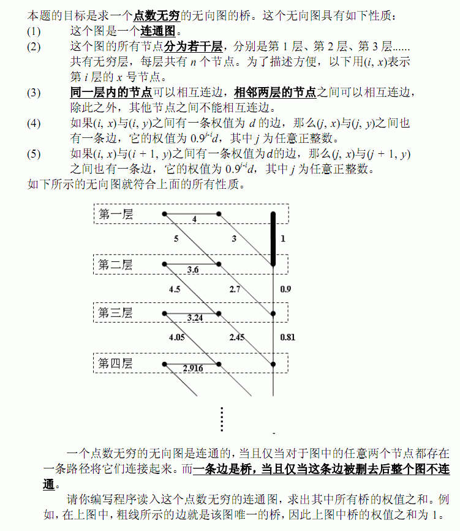

# #2307. [Ctsc2011]无穷图的桥 

内存限制：128 MiB时间限制：30 Sec

## 题目描述

## 输入格式

第一行包括三个由空格隔开的非负整数 n、m1、m2。 从第 2行到第m1 + 1 行，每行有三个正整数x、y、d，表示(1, x)与(1, y)之间有一条权值为d的边。 
从第 m1 + 2 行到第 m1 + m2 + 1 行，每行有三个正整数x、y、d，表示(1, x)
与(2, y)之间有一条权值为 d的边。 
每行的三个整数之间都用一个空格隔开。 图中两个点x 和 y之间可能有多于
1条边连接，一条边连接的两个节点可能相同。

## 输出格式

只有一行，包含一个实数，即所有桥的权值之和，四舍五入保留两位小数。

## 样例

### 样例输入

    
    【样例输入1】 
    3 1 3 
    1 2 4 
    1 2 5 
    2 3 3 
    3 3 1 
    【样例输出1】 
    1.00 
    【样例说明1】 
    这就是问题描述中所举的例子。 
    
    【样例输入2】 
    1 1 1 
    1 1 100 
    1 1 1 
    【样例输出2】 
    10.00 
    

### 样例输出

## 数据范围与提示

数据编号       n                            m1                        m2 
1                   &le; 10                  &le; 50                     &le; 50 
2                  &le; 10 000          &le; 40 000              &le; 40 000 
3                 &le; 300 000         &le; 500 000               = 1 
4~7            &le; 300 000          &le; 500 000           &le; 500 
8~10         &le; 300 000          &le; 500 000           &le; 500 000

100%的数据中，d &le; 100。
