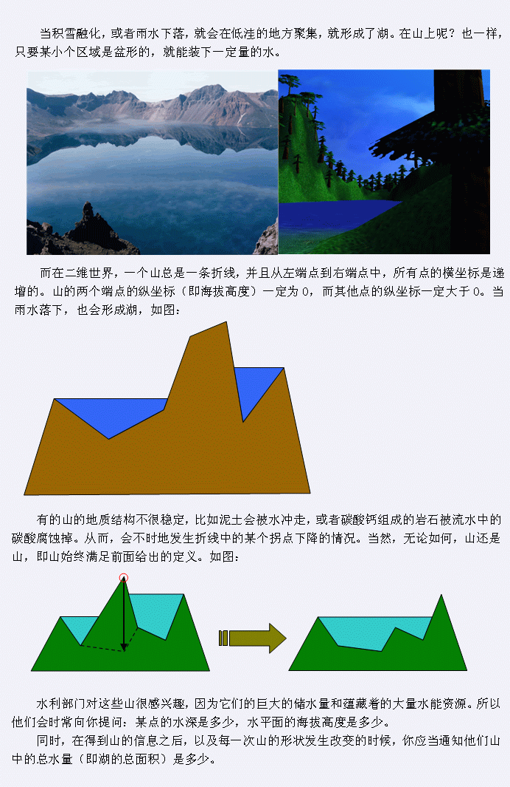

# #2341. 山中的湖

内存限制：128 MiB时间限制：20 Sec

## 题目描述

## 输入格式

第一行两个正整数，N表示山的折线上的拐点数（包括端点在内），M则是你收到的消息数。3 <= N <= 100000，0 <= M <= 100000。

后面N行，第i行有两个非负整数Xi和Yi，表示折线上第i个拐点的坐标。

后面M行，每行是以下两种情况之一：

Survey x 

表示测量x位置的水深和水平面的海拔高度。x是一个实数，保证X1 <= x <= Xn。

Descend x y 

表示输入中的第x个点的地面的海拔高度降低到了y。

题中所有坐标（包括Descend中的）都是0到1000000之间的整数。

## 输出格式

输出格式：

首先输出一开始的山上的储水量。

对于每个Survey，输出一行a b。a表示该位置的水深（如果没有水则为0），b表示该位置的水面的海拔高度（如果没有水，则为该位置的土地的高度）。

对于每个Descend，输出新的储水量。

输出中的所有数字保留2位小数。

## 样例

### 样例输入

    
    7 3
    0 0
    1 4
    2 2
    3 6
    4 4
    6 5
    8 0
    Survey 5.5
    Descend 3 2
    Survey 5.5
    
    

### 样例输出

    
    2.75
    0.25 5.00
    4.00
    0.00 4.75
    

## 数据范围与提示
