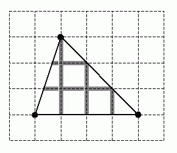

# #2349. [Baltic2011]Polygon

内存限制：256 MiB时间限制：10 Sec

## 题目描述

一个有N个顶点的简单多边形，画在一个无限大的矩形网格中。对于这样的多边形，只有相邻的两边在它们共同的顶点处相交；没有其它边相交或有接触。该多边形的顶点都在网格的网点上，也就是说，多边形的顶点都是整数坐标。

你的任务是得到严格地处于给定的多边形中的网格线的总长度（这些网格的线段片段在下面的图中着重描出了）。

## 输入格式

 

第一行包括一个整数N，即多边形的顶点数。

以下N行包括2个整数x和y，即顶点的坐标。顶点将按顺时针或逆时针顺序给出。所有顶点均不相同，但可能有连续2个以上的顶点是在同一条直线上的。

## 输出格式

 

输出只有一行，给出一个带小数部分的数（decimal number）：严格地处于给定的多边形中的网格线的总长度。

数据范围

3&le; N &le;100 000

-500 000 000&le; x, y &le;500 000 000

有50分的数据点中，所有多边形的边都处于网格线上。

评分

若你的输出与标准答案足够接近即可判正确。

更准确地说：假设你的输出为L，标准答案为R。那至少以下两个条件至少要有一条成立:

l      |L - R|&le;R∙10-6（相对精确）

l      |L - R|&le;10-6（绝对精确）

 

## 样例

### 样例输入

    
    3
    5 1
    2 4
    1 1
    

### 样例输出

    
    10.0
    

## 数据范围与提示

水平的线段总长度为4/3+8/3=4，垂直的线段总长度为3+2+1=6。总长度为4+6=10。
