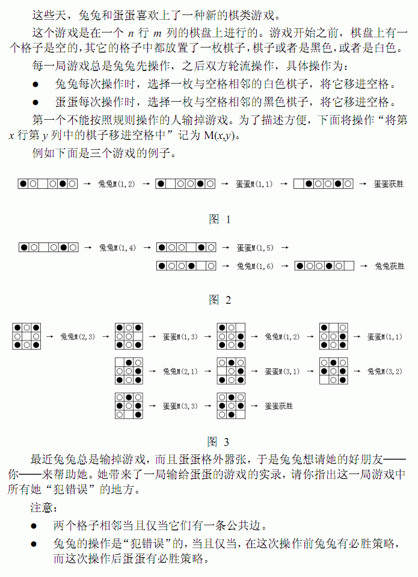
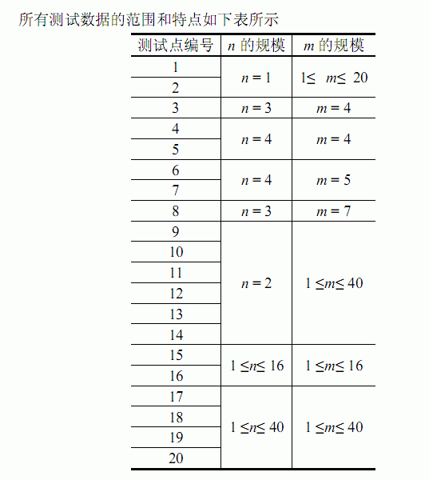

# #2437. [Noi2011]兔兔与蛋蛋

内存限制：128 MiB时间限制：10 Sec

## 题目描述

## 输入格式

输入的第一行包含两个正整数 n、m。 
接下来 n行描述初始棋盘。其中第i 行包含 m个字符，每个字符都是大写英文字母"X"、大写英文字母"O"或点号"."之一，分别表示对应的棋盘格中有黑色棋子、有白色棋子和没有棋子。其中点号"."恰好出现一次。 
接下来一行包含一个整数 k（1&le;k&le;1000） ，表示兔兔和蛋蛋各进行了k次操作。 
接下来 2k行描述一局游戏的过程。其中第 2i &ndash; 1行是兔兔的第 i 次操作（编号为i的操作） ，第2i行是蛋蛋的第i次操作。每个操作使用两个整数x,y来描述，表示将第x行第y列中的棋子移进空格中。 
输入保证整个棋盘中只有一个格子没有棋子， 游戏过程中兔兔和蛋蛋的每个操作都是合法的，且最后蛋蛋获胜。 

## 输出格式

输出文件的第一行包含一个整数r，表示兔兔犯错误的总次数。 
接下来r 行按递增的顺序给出兔兔&ldquo;犯错误&rdquo;的操作编号。其中第 i 行包含一个整数ai表示兔兔第i 个犯错误的操作是他在游戏中的第 ai次操作。 
1 &le;n&le; 40， 1 &le;m&le; 40 

## 样例

### 样例输入

    
    样例一：
    1 6 
    XO.OXO 
    1 
    1 2 
    1 1 
    样例二：
    3 3 
    XOX 
    O.O 
    XOX 
    4 
    2 3 
    1 3 
    1 2 
    1 1 
    2 1 
    3 1 
    3 2 
    3 3 
    样例三：
    4 4 
    OOXX 
    OXXO 
    OO.O 
    XXXO 
    2 
    3 2 
    2 2 
    1 2 
    1 3 
    

### 样例输出

    
    样例一：
    1 
    1 
    样例二：
    0
    样例三：
    2
    1
    2
    
    样例1对应图一中的游戏过程
    样例2对应图三中的游戏过程
    

## 数据范围与提示

