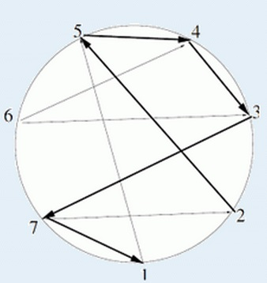

# #2859. [Ceoi2012]Sailing Race

内存限制：128 MiB时间限制：10 Sec

## 题目描述

在一个圆环上，有N个地点，这些地点按照逆时针顺序用正整数1..N编号。有些地点间存在直线道路可以到达，但

道路并不是双向的，也就是说如果存在a到b的道路，不一定同时存在b到a的道路。现在你要从某个地点开始，沿着

道路走，每个地点最多被经过一次，并且你走过的道路对应的线段只能在公共端点处相交。但是有时候允许一些特

例，具体说就是你走过的某条道路可以和最初走的道路相交最多一次。

你的任务是求出最多能走过的道路数，并给出一个可行的起点。

## 输入格式

第一行两个非负整数N, K。如果K = 0表示不允许特例，K = 1表示允许特例。

下面N行，依次描述每个地点可以到达的地点编号。每行以0结束。

N &le; 500。

## 输出格式

第一行一个非负整数，表示最多可以走的道路数。

## 样例

### 样例输入

    
    7 1
    5 0
    5 0
    7 0
    3 0
    4 0
    4 3 0
    2 1 0
    

### 样例输出

    
    5
    2
    

## 数据范围与提示
