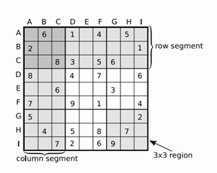

# #2910. 数独

内存限制：128 MiB时间限制：1 Sec

## 题目描述

众所周知，涉及数独的题都不会是很难的题目，所以这道题也很简单。

3*3 Sudoku Puzzle: 每行,每列,9个3*3的子矩阵中1~9的每个数恰好出现一次.现在给一个正确的Sudoku Puzzle和一个Unsolved Puzzle,问是否可以将Unsolved Puzzle空的格子填满后通过给定的5种操作得到那个Sudoku Puzzle。操作共有5种：

1.顺时针或逆时针旋转整个9*9方格

2.交换任一个column segment中的任意两列

3.交换任意个row segment中的任意两行

4.交换任意两个row segments或column segments

5.1~9的数字作一个置换

## 输入格式

                                                                          

第一行T为测试组数，对于每组数据会先输出9*9的Sudoku Puzzle，再输出9*9的Unsolved Puzzle，每组测试数据之间有一空行。

## 输出格式

 

如可行输出一行&ldquo;Yes&rdquo;，不可行输出&ldquo;No&rdquo;。引号不用输出。

## 样例

### 样例输入

    
    2
    963174258
    178325649
    254689731
    821437596
    496852317
    735961824
    589713462
    317246985
    642598173
    060104050
    200000001
    008305600
    800407006
    006000300
    700901004
    500000002
    040508070
    007206900
     
    534678912
    672195348
    198342567
    859761423
    426853791
    713924856
    961537284
    287419635
    345286179
    010900605
    025060070
    870000902
    702050043
    000204000
    490010508
    107000056
    040080210
    208001090
    
    

### 样例输出

    
    Yes
    No
    【数据规模】
    100%：T
    

## 数据范围与提示
