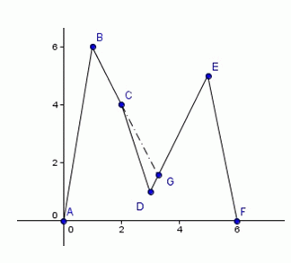

# #3116. 登顶计划

内存限制：512 MiB时间限制：20 Sec

## 题目描述

二维平面上的山脉由一系列顶点确定：(x1,y1),(x2,y2)...(xn,yn)。相邻的两个顶点之间由线段相连（保证xi严格递增），这样就构成了一座连绵的山脉，每个点的y值代表了该点的高度。如下图所示：

.jpg)

我们定义山脉的内部为顶点之间的折线与x轴的所夹部分（不包括顶点之间的折线）。如果顶点A与顶点B之间的连线段没有穿过山脉的内部，则我们称顶点A能看见顶点B（或B能看见A）。

 

现在pty从某个顶点出发，想要登到山脉的顶峰（最高点），他只能在顶点之间的折线上行走。经过思考，他将采取如下的一种登山方式：

1、站在出发点，向左右看去，如果此时能够看到的最高山峰在左侧，则向左侧走去，否则向右侧走去。

2、在行走的同时，pty仍然观察着此时左右的最高山峰，一旦发现一座比之前看到的都要高的山峰，他将向此时的最高峰走去。

3、如果存在某个时刻，pty所站立的位置比左右能看到的最高峰都要高，则他到达了山脉的顶峰，此时他的爬山过程结束。

 

pty想知道，采取如上的策略，从每个顶点出发，到达最高点的路程分别是多少？（平面中两点的距离等于它们之间连线段的长度）

 

## 输入格式

第一行一个整数n，表示山脉顶点个数。

接下来n行，第i行两个整数xi,yi，表示第i个顶点的坐标。

保证xi严格递增，yi互不相同（y1,yn除外），xi,yi都为非负整数。保证y1,yn的值为0。

 

## 输出格式

输出共n行：每行一个实数

第i行的实数表示从第i个顶点出发，到达最高点的路程。

如果输出与标准输出的误差不超过$1e-2$，则该测试点得满分，否则得0分。

 

## 样例

### 样例输入

    
    6
    0 0
    1 6
    2 4
    3 1
    5 5
    6 0
    
     
    
    
    

### 样例输出

    
    6.08
    0.00
    2.24
    6.52
    9.87
    14.97
    
     
    
    

## 数据范围与提示

【数据规模与约定】

所有的数据满足xi,yi<=100000。

1-4的测试点满足n<=20。

5-8的测试点，满足n<=70。

9-10的测试点，满足n<=100000且每个顶点都能直接看到最高点。

11-14的测试点，满足n<=30000。

15-20的测试点，满足n<=100000。

路线说明：

A点出发：A->B

B点出发：B

C点出发：C->B

D点出发：D->G->D->C->B

E点出发：E->D->C->B

F点出发：F->E->D->C->B

从D点出发时，看到的最高点是E，当步行至G点时，发现更高点B，转向后一直步行向B点。从其它点出发后都不需要转向。
