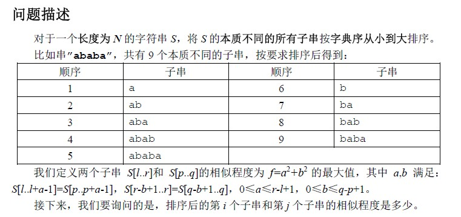

# #3230. 相似子串

内存限制：128 MiB时间限制：20 Sec

## 题目描述

## 输入格式

输入第1行，包含3个整数N，Q。Q代表询问组数。
第2行是字符串S。
接下来Q行，每行两个整数i和j。（1&le;i&le;j）。

## 输出格式

输出共Q行，每行一个数表示每组询问的答案。如果不存在第i个子串或第j个子串，则输出-1。

## 样例

### 样例输入

    
    5 3
    ababa
    3 5
    5 9
    8 10
    
    
    

### 样例输出

    
    18
    16
    -1
    
    
    

## 数据范围与提示

样例解释
第1组询问：两个子串是&ldquo;aba&rdquo;,&ldquo;ababa&rdquo;。f = 32 + 32 = 18。
第2组询问：两个子串是&ldquo;ababa&rdquo;,&ldquo;baba&rdquo;。f = 02 + 42 = 16。
第3组询问：不存在第10个子串。输出-1。

数据范围
N&le;100000，Q&le;100000，字符串只由小写字母'a'~'z'组成
