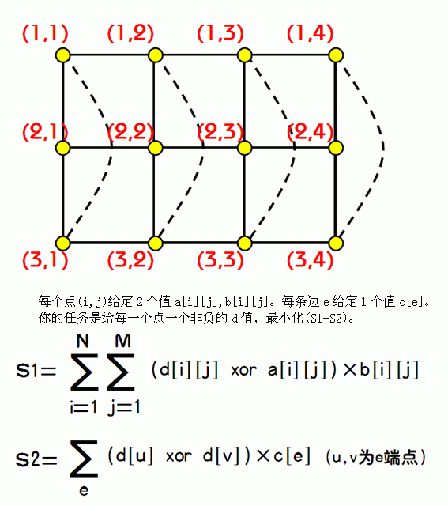

# #3254. Xor-Mul Chessboard

内存限制：128 MiB时间限制：10 Sec

## 题目描述

一个n*m的棋盘，左上角为(1,1),右下角为(n,m)。相邻的2点之间有连边（如下图中实线）特殊地，(1,i)与(n,i)也连有一条边（如下图中虚线）,i=1..m。

如下图，就是一个n=3,m=4 的棋盘。

## 输入格式

第一行2个整数n,m。

接着n行，每行m个数，其中第i行第j个数表示a[i][j]。

接着n行，每行m个数，其中第i行第j个数表示b[i][j]。

接着n行，每行m-1个数，其中第i行第j个数表示(i,j)与(i,j+1)的边的c值。

接着n-1行，每行m个数，其中第i行第j个数表示(i,j)与(i+1,j)的边的c值。

最后一行m个数，其中第i个数表示(1,i)与(n,i)的边的c值。

## 输出格式

一个整数，表示S1+S2的最小值

## 样例

### 样例输入

    
    2 2
    3 6
    7 3
    9 9
    1 8
    9
    5
    3 9
    4 3
    
    

### 样例输出

    
    49
     
    

## 数据范围与提示

对于100%的数据 2<=n<=5 1<=m<=10000
a,b,c的值均为不大于10^6的正整数。
