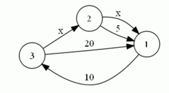

# #3482. [COCI2013]hiperprostor

内存限制：256 MiB时间限制：20 Sec

## 题目描述

在遥远的未来，行星之间的食品运输将依靠单向的贸易路线。每条路径直接连接两个行星，且其运输时间是已知的

。贸易商协会打算利用一项最近发现的新技术&mdash;&mdash;超空间旅行，以增加一些新的航线。通过超空间旅行的航线也是

单向的。由于该项技术仍处于试验阶段，超空间旅行的时间目前是未知的，但它不取决于行星之间的距离，所以每

个超空间旅行的路线将花费等量的时间。下图是三个相互联通的行星及其运输时间的例子。行星使用正整数标号，

超空间旅行时间记为&ldquo;x&rdquo;（图片对应第输入样例）：过境的时间以天计，并且始终是一个正整数。贸易商协会希

望对引进新航线的后果进行分析：对于某两个行星A和B，他们想知道对于任意的x，从A到B的最短路径的总中转时

间的所有可能的值。例如，在上述情况中，从星球2到星球1的最短路径所需时间可以取值5（如果x&ge;5），4，3，2

，或1天（如果x<5）

 

## 输入格式

输入的第一行包含两个整数P和R，分别代表行星的数目和航线数量，1&le;P&le;500，0&le;R&le;10000。接下来的R条航线

路径包含两或三个整数：行星标号C和D（1&le;C，D&le;P，C&ne;D），和T，从C到D的旅行时间。对于传统的路径，T是一

个整数（1&le;T&le;1000000），超空间航线中，T是字符&ldquo;x&rdquo;。 可以存在多行有两个相同的行星。下面的行中包含的

整数Q（1&le;Q&le;10），表示查询的数量。以下Q行包含两个整数星球标号（A和B，A&ne;B），为贸易商协会的查询：&ldquo;

从A到B的最短路径时间的可能值是什么？

## 输出格式

输出必须包含q行，每行??一个查询。每一行都必须包含两个整数：不同的可能值的数目和它们的总和。如果不同

的可能值的数目是无限的，该行只输出&ldquo;inf&rdquo;。如果没有从A到B的路径，不同的可能值的数目及它们的总和都是0

。

## 样例

### 样例输入

    
    4 4
    1 2 x
    2 3 x
    3 4 x
    1 4 8
    3
    2 1
    1 3
    1 4
    
    
    

### 样例输出

    
    0 0
    inf
    3 17
    

## 数据范围与提示

 2016.6.15新加数据一组，未重测
