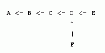
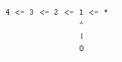
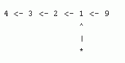
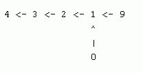

# #3537. [Usaco2014 Open]Code Breaking 

内存限制：128 MiB时间限制：10 Sec

## 题目描述

 The cows keep getting in trouble by taking rides on Farmer John's tractor, so he has hidden the keys to the tractor in a fancy new safe in his office. Undeterred, the cows have vowed to try and break into this safe. The safe is protected by a rather complicated passcode system. The passcode entry system is arranged as a rooted tree of N (1 <= N <= 20,000) nodes, each of which requires a digit between 0 and 9. The nodes are indexed 0..N-1. The only information that the cows have is that certain sequences of length 5 do not occur along particular paths upwards through the tree. For instance, suppose the tree is the following (rooted at A): 

 The cows might know that the sequence 01234 does not occur starting at F, and that the sequence 91234 does not occur starting at E. This information rules out 19 possible passcodes: all those of the form 

or

 

 which gives 19 once we account for the fact that 

appears twice. Given M (1 <= M <= 50,000) length-5 sequences, together with their starting nodes in the tree, help the cows figure out how many passcodes have been ruled out. You should compute your answer modulo 1234567. 

有一棵N个节点的有根树,每个节点可以填0~9.

有M个事实,就是从X开始往祖先一直跑的的包含X的5个节点(保证X上面一定存在这样一条路径,也就是说X的深度至少为5),一定不是ABCDE.(0<=A,B,C,D,E<=9)

求,根据这M个事实,共有多少种给这棵树全部填上数的方案一定是不可能的.

## 输入格式

* Line 1: Two space-separated integers, N and M.

 * Lines 2..N: Line i+1 contains a single integer p(i), denoting the parent of node i in the tree (0 <= p(i) < i). 

* Lines N+1..N+M: Line N+i describes the ith sequence known not to occur in the code. The line will contain v(i) and s(i) separated by a space, where v(i) is the starting node of the sequence, and s(i) is a 5-digit string known not to occur starting at v(i) and proceeding upward in the tree. It is guaranteed that the root is at least 4 steps upward from v(i).

## 输出格式

* Line 1: A single integer giving the number of ruled-out configurations, modulo 1234567. 

## 样例

### 样例输入

    
    6 2
    0
    1
    2
    3
    3
    4 01234
    5 91234
    
    

### 样例输出

    
    19 
    

## 数据范围与提示
