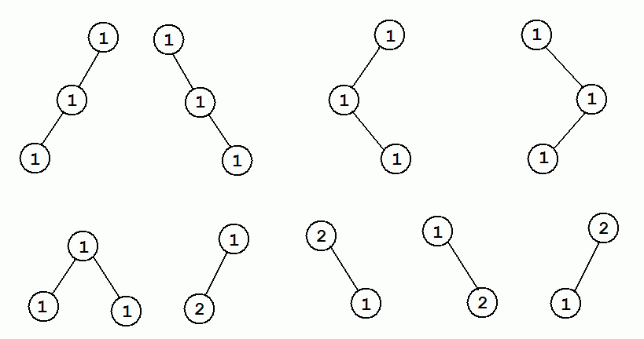

# #3625. [Codeforces Round #250]小朋友和二叉树

内存限制：256 MiB时间限制：40 Sec

## 题目描述

我们的小朋友很喜欢计算机科学，而且尤其喜欢二叉树。
考虑一个含有n个互异正整数的序列c[1],c[2],...,c[n]。如果一棵带点权的有根二叉树满足其所有顶点的权值都在集合{c[1],c[2],...,c[n]}中，我们的小朋友就会将其称作神犇的。并且他认为，一棵带点权的树的权值，是其所有顶点权值的总和。
给出一个整数m，你能对于任意的s(1<=s<=m)计算出权值为s的神犇二叉树的个数吗？请参照样例以更好的理解什么样的两棵二叉树会被视为不同的。
我们只需要知道答案关于998244353(7*17*2^23+1,一个质数)取模后的值。

## 输入格式

第一行有2个整数 n,m(1<=n<=10^5; 1<=m<=10^5)。
第二行有n个用空格隔开的互异的整数 c[1],c[2],...,c[n]（1<=c[i]<=10^5)。

## 输出格式

输出m行，每行有一个整数。第i行应当含有权值恰为i的神犇二叉树的总数。请输出答案关于998244353(=7*17*2^23+1,一个质数)取模后的结果。

## 样例

### 样例输入

    
    样例一：
    2 3
    1 2
    样例二：
    3 10
    9 4 3
    样例三：
    5 10
    13 10 6 4 15
    
    

### 样例输出

    
    样例一：
    1
    3
    9
    样例二：
    0
    0
    1
    1
    0
    2
    4
    2
    6
    15
    样例三：
    0
    0
    0
    1
    0
    1
    0
    2
    0
    5
    
    

## 数据范围与提示

对于第一个样例，有9个权值恰好为3的神犇二叉树：

