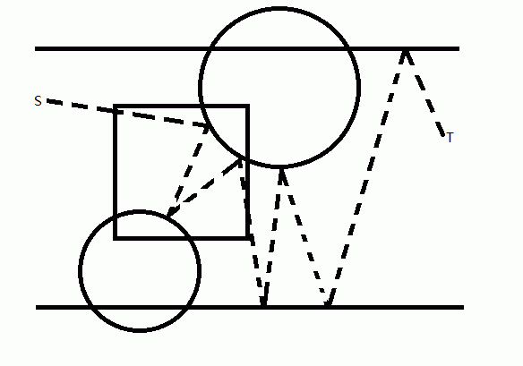

# #3630. [JLOI2014]镜面通道

内存限制：128 MiB时间限制：10 Sec

## 题目描述

在一个二维平面上，有一个镜面通道，由镜面AC，BD组成，AC，BD长度相等，且都平行于x轴，B位于（0，0）。通道中有n个外表面为镜面的光学元件，光学元件&alpha;为圆形，光学元件&beta;为矩形（这些元件可以与其他元件和通道有交集，具体看下图）。光线可以在AB上任一点以任意角度射入通道，光线不会发生削弱。当出现元件与元件，元件和通道刚好接触的情况视为光线无法透过（比如两圆相切）。现在给出通道中所有元件的信息（&alpha;元件包括圆心坐标和半径xi，yi，ri，&beta;元件包括左下角和右上角坐标x1，y1，x2，y2）

.jpg)

如上图，S到T便是一条合法线路。

.jpg)

当然，显然存在光线无法透过的情况，现在交给你一个艰巨的任务，请求出至少拿走多少个光学元件后，存在一条光线线路可以从CD射出。

下面举例说明：

现在假设，取走中间那个矩形，那么就可以构造出一条穿过通道的光路，如图中的S到T。

## 输入格式

第一行包含两个整数，x，y，表示C点坐标

第二行包含一个数字，n，表示有n个光学元件

接下来n行

第一个数字如果是1，表示元件&alpha;，后面会有三个整数xi，yi，ri分别表示圆心坐标和半径

第一个数字如果是2，表示元件&beta;，后面会有四个整数x1，y1，x2，y2分别表示左下角和右上角坐标（矩形都平行，垂直于坐标轴）

## 输出格式

 

输出包含一行，至少需要拿走的光学元件个数m

## 样例

### 样例输入

    
    1000 100
    
    6
    
    1 500 0 50
    
    2 10 10 20 100
    
    2 100 10 200 100
    
    2 300 10 400 100
    
    2 500 10 600 100
    
    2 700 0 800 100
    
    
    

### 样例输出

    
    2
    
    
    

## 数据范围与提示

x<=100000，y<=1000，n<=300

 
