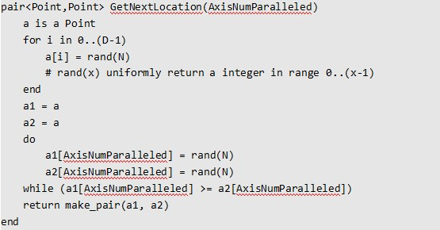

# #3841. ZCC Loves Intersection

内存限制：128 MiB时间限制：1 Sec

## 题目描述

After beats all opponents in 3-dimension-world OI, ZCC feels bored and sets about going to other universes. In a universe with D dimension(s), ZCC finds D segments floating in the air. To be more precise: if we build a rectangular coordinate system with D axis, each of the segments is parallel with one axis, whose endpoints have a coordination of which all components belong to the set {x&isin;Z|0&le;x＜N}. For each axis, there is exactly one segment parallel with it.

Each of the D segments changes location every second. Read the pseudo code below for more details:

Every second, from every pair of segments intersect, ZCC acquires a unit of Energy. Calculate the Expectation of the amount of the acquired energy per second please.

## 输入格式

There are several test cases in one input file. EOF indicates the end of input file.

Every test case contain two positive numbers N, D in one line.

It is guaranteed that 1＜N&le;10^9, D&le;99. The number of test cases&le;10.

## 输出格式

For each test case, output a line with an integer or an irreducible fraction p/q, which is the Expectation.

## 样例

### 样例输入

    
    2 2
    3 3
    5 5
    

### 样例输出

    
    1
    49/81
    18/625
    

## 数据范围与提示

For the first test case of the sample input, there are 2 segments in a 2*2 lattice.

Because two endpoint couldn&rsquo;t coincide, two segments must be (0,y)-(1,y) and (x,0)-(x,1). (x, y&isin;{0,1}) 

Thus, they always intersect at (x,y). As an irreducible fraction the answer is 1/1, where q = 1, so we should output an integer 1 instead.
