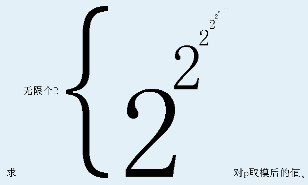

# #3884. 上帝与集合的正确用法

内存限制：128 MiB时间限制：5 Sec

## 题目描述

根据一些书上的记载，上帝的一次失败的创世经历是这样的：

第一天，上帝创造了一个世界的基本元素，称做&ldquo;元&rdquo;。

第二天，上帝创造了一个新的元素，称作&ldquo;&alpha;&rdquo;。&ldquo;&alpha;&rdquo;被定义为&ldquo;元&rdquo;构成的集合。容易发现，一共有两种不同的&ldquo;&alpha;&rdquo;。

第三天，上帝又创造了一个新的元素，称作&ldquo;&beta;&rdquo;。&ldquo;&beta;&rdquo;被定义为&ldquo;&alpha;&rdquo;构成的集合。容易发现，一共有四种不同的&ldquo;&beta;&rdquo;。

第四天，上帝创造了新的元素&ldquo;&gamma;&rdquo;，&ldquo;&gamma;&rdquo;被定义为&ldquo;&beta;&rdquo;的集合。显然，一共会有16种不同的&ldquo;&gamma;&rdquo;。

如果按照这样下去，上帝创造的第四种元素将会有65536种，第五种元素将会有2^65536种。这将会是一个天文数字。

然而，上帝并没有预料到元素种类数的增长是如此的迅速。他想要让世界的元素丰富起来，因此，日复一日，年复一年，他重复地创造着新的元素&hellip;&hellip;

然而不久，当上帝创造出最后一种元素&ldquo;&theta;&rdquo;时，他发现这世界的元素实在是太多了，以致于世界的容量不足，无法承受。因此在这一天，上帝毁灭了世界。

至今，上帝仍记得那次失败的创世经历，现在他想问问你，他最后一次创造的元素&ldquo;&theta;&rdquo;一共有多少种？

上帝觉得这个数字可能过于巨大而无法表示出来，因此你只需要回答这个数对p取模后的值即可。

你可以认为上帝从&ldquo;&alpha;&rdquo;到&ldquo;&theta;&rdquo;一共创造了10^9次元素，或10^18次，或者干脆&infin;次。

一句话题意：

## 输入格式

接下来T行，每行一个正整数p，代表你需要取模的值

## 输出格式

T行，每行一个正整数，为答案对p取模后的值

## 样例

### 样例输入

    
    3
    2
    3
    6
    

### 样例输出

    
    0
    1
    4
    

## 数据范围与提示

对于100%的数据，T<=1000,p<=10^7
