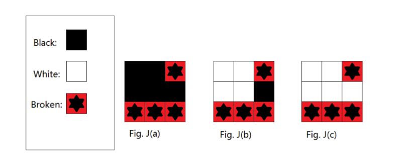

# #3905. Square

内存限制：256 MiB时间限制：10 Sec

## 题目描述

Nothing is more beautiful than square! So, given a grid of cells, each cell being black or white, it is reasonable to evaluate this grid&rsquo;s beautifulness by the side length of its maximum continuous subsquare which fully consists of white cells.
Now you&rsquo;re given an N &times; N grid, and the cells are all black. You can paint some cells white. But other cells are broken in the sense that they cannot be paint white. For each integer i between 0 and N inclusive, you want to find the number of different painting schemes such that the beautifulness is exactly i. Two painting schemes are considered different if and only if some cells have different colors. Painting nothing is considered to be a scheme.

For example, N = 3 and there are 4 broken cells as shouwn in Fig. J(a). There are 2 painting schemes for i=2 as shown in Fig. J(b) and J(c).
You just need to output the answer modulo 10^9 + 7.

给你一个n * n(n <= 8)的棋盘，上面有一些格子必须是黑色，其它可以染
黑或者染白，对于一个棋盘，定义它的优美度为它上面最大的连续白色
子正方形的边长，对于每个0 <= i <= n，问有多少种染色方案使得棋盘的
优美度为i？

## 输入格式

The first line contains an integer T (T &le; 10) denoting the number of the test cases.
For  each test case, the first line contains an integer N (1 &le; N &le; 8),  denoting the size of the grid is N &times; N . Then N lines follow, each line  containing an N-character string of &ldquo;o&rdquo; and &ldquo;*&rdquo;, where &ldquo;o&rdquo; stands for a  paintable cell and &ldquo;*&rdquo; for a broken cell.

## 输出格式

For each test case, for each integer i between 0 and N inclusive, output the answer in a single line.

## 样例

### 样例输入

    
    2
    3
    oo*
    ooo
    ***
    8
    oooooooo
    oooooooo
    oooooooo
    oooooooo
    oooooooo
    oooooooo
    oooooooo
    oooooooo
    

### 样例输出

    
    1
    29
    2
    0
    1
    401415247
    525424814
    78647876
    661184312
    550223786
    365317939
    130046
    1
    

## 数据范围与提示
