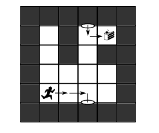

# #3919. [Baltic2014]portals

内存限制：256 MiB时间限制：40 Sec

## 题目描述

    
    给出一张四连通的网格图，'#'代表墙,'.'代表空地,'S'代表出发点,'C'代表目的地，地图四周都是墙,求S到C的最短路。
    
    走的时候可以向上下左右中的某个方向发射奇怪的东西(portals)，portals会贴在发射方向的墙上。
    
    地图上只允许同时存在两个portals，如果已经发射了两个再发射第三个，那么你需要在之前的那两个中的选一个使它消失。
    
    两个portals可以存在于一块墙的两面，但不能存在于一块墙的同面。
    
    当你身边是墙且那块墙上有面向你的portals时，你可以走进那个portals，从另一个portals出来。
    
    相邻两点距离为1，走portals距离也为1
    

## 输入格式

第一行2个数R,C,表示矩形的长和宽

接下来R行,每行一个长为C的字符串,表示这张图

## 输出格式

输出一行表示答案

## 样例

### 样例输入

    
    4 4
    .#.C
    .#.#
    ....
    S...
    

### 样例输出

    
    4
    

## 数据范围与提示

对于100%的数据 1 &le; R &le; 1000, 1 &le; C &le; 1000.

保证有解
