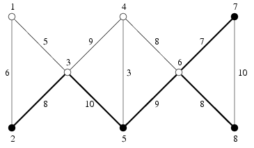

# #4158. [POI2007]Railway

内存限制：32 MiB时间限制：10 Sec

## 题目描述

比特铁路系统需要重新布置。通过对铁路网络深入的分析，有一些站点需要被移除，有一些道路也需要被移除。

整个铁路网络可以看做一张由n个点，m条道路组成的无向图。从每一个点出发都可以通过直接或间接的道路到达其它所有点。两个站点之间最多只有一条道路。每一条道路都有一个正整数费用。你的任务是决定哪些点和道路需要被保留。

要求：

1.从每一个没被移除的点出发都能通过直接或间接的没被移除的道路到达其他所有没被移除的点。

2.剩下的道路的费用总和要比较小，即不能超过最优解的两倍。

## 输入格式

第一行包含两个正整数n,m(2<=n<=5000,1<=m<=500000)，表示点数和边数。

接下来m行，每行包含三个正整数a,b,u(1<=a,b<=n,a!=b,1<=u<=100000)，表示a和b之间有一条费用为u的道路。

最后一行的开头为一个正整数p(2<=p<=n,p*m<=15000000)，表示必须要保留的点数。

接下来包含p个正整数，按递增顺序依次给出必须保留的点的编号。

## 输出格式

第一行包含两个正整数c,k，其中c表示剩余道路的费用总和，k表示剩余道路的条数。

接下来k行，每行包含两个正整数a,b，表示一条道路的两个端点。

如有多组解，输出任意一组。

## 样例

### 样例输入

    
    8 11
    1 2 6
    3 1 5
    2 3 8
    3 4 9
    3 5 10
    5 4 3
    5 6 9
    6 4 8
    6 8 8
    6 7 7
    8 7 10
    4 2 5 7 8
    

### 样例输出

    
    42 5
    2 3
    3 5
    5 6
    6 7
    6 8
    

## 数据范围与提示

