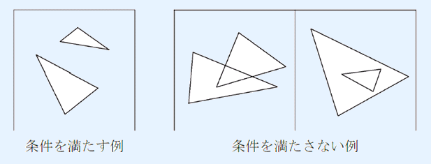
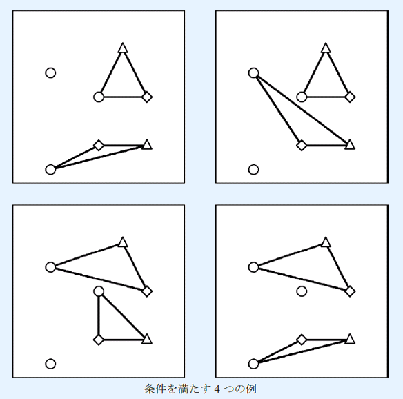

# #4246. 两个人的星座

内存限制：256 MiB时间限制：40 Sec

## 题目描述

JOI酱和IOI酱是好朋友。某天，JOI酱与IOI酱决定去山上的某个展望台进行天体观测。

从展望台上可以观测到N颗星星，编号为1...N。每颗星星的颜色为红色、蓝色、黄色中的一种。

在展望台上观测到的星星可以用坐标系上的点来表示。在坐标系上，星i(1<=i<=N)对应的点为Pi(Xi,Yi)。坐标系上的点两两不同，且不存在三点共线。

JOI酱和IOI酱想要设立一个叫做&ldquo;JOIOI座&rdquo;的星座。首先。两个人决定使用红色、蓝色、黄色三种颜色的星各一个构成的三角形。他们将这样的三角形称作&ldquo;好三角形&rdquo;。

两人将满足以下条件的好三角形无序二元组作为JOIOI座的候补：

两个三角形没有公共点(包括内部和边界)。换言之，两个三角形之间既不相交，也不存在某个三角形包含另一个三角形。

 .jpg)

JOI酱和IOI酱想知道构成JOIOI座的候补一共有多少种方案。

注意如果构成三角形的6个点一样但是构成三角形的方式不同，算作不同的方案。

现在给出展望台上能观测到的星星的信息，请求出构成JOIOI座的候补一共有多少种方案

## 输入格式

第一行一个整数N，代表展望台上能观测到的星星的数量。

接下来N行，第i行(1<=i<=N)有三个空格分隔的整数Xi,Yi,Ci，表示星i的坐标为Pi(Xi,Yi)，Ci表示星i的颜色，其中0代表红色，1代表蓝色，2代表黄色。

## 输出格式

输出一行一个整数，表示JOIOI座候补的方案数。

## 样例

### 样例输入

    
    7
    0 0 0
    2 0 1
    1 2 2
    -2 1 0
    -2 -3 0
    0 -2 1
    2 -2 2
    

### 样例输出

    
    4
    

## 数据范围与提示

样例中，JOIOI的候补有以下四种方案：

 

6<=N<=3000

-10^5<=Xi<=10^5(1<=i<=N)

-10^5<=Yi<=10^5(1<=i<=N)

0<=Ci<=2(1<=i<=N)

每种颜色的星至少存在一个

Pi&ne;Pj(1<=i<j<=N)

Pi,Pj,Pk不共线(1<=i<j<k<=N)

请注意你的常数
