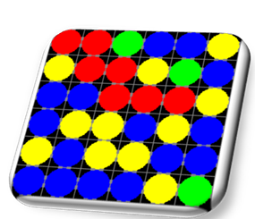
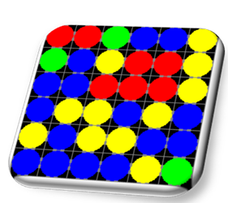

# #4354. Magic cube

内存限制：256 MiB时间限制：2 Sec

## 题目描述

莱因斯坦(LineStein)迷上了一种名叫二维魔方(Two dimensional Magic cube)的游戏，游戏规则如下：给一个N*N的矩阵，每个单元矩阵有一种颜色（如图）。

 

然后要按照这样一种规则移动魔方：可以将任何一行（或一列）向左右（或上下）移动，并且如果向左边移动，那么移出魔方的单元矩阵将在右方按顺序出现。如上图，将第二行向右移动两个单位将如下图所示。

 

游戏开始时，玩家会得到魔方的初始状态与目标状态，玩家需要把魔方按照规则移动到目标状态。

看起来这个游戏并不很难。但是说实话，莱因斯坦并不擅长这种游戏。他能成功地完成最简单的游戏，但是当他面对一个更复杂的游戏时，他根本无法找到解法。

对于这样可怜的玩家，帮助他的最好方法是告诉他游戏是否有解。如果他知道游戏是无解的，他就不必再把如此多的时间浪费在它上面。

## 输入格式

本题有多组数据，输入文件第一行为一个整数T，表示输入数据组数。接下来共有T组数据。每组数据第一行有一个整数N，表示魔方的数量级。接下来会给出两个魔方，分别表示魔方的初始状态与目标状态，其中颜色用不同的整数表示。

## 输出格式

对于每一组输入数据，如果有解则输出一行&ldquo;Yes&rdquo;，否则输出一行&ldquo;No&rdquo;。

## 样例

### 样例输入

    
    2
    3
    1 2 3
    4 5 6
    7 8 9
    2 1 3
    4 5 6
    7 8 9
    6
    1 1 2 3 3 4
    4 1 1 4 2 3
    3 3 1 1 1 4
    3 4 4 3 4 3
    4 3 4 4 3 3
    3 3 3 3 4 2
    1 1 2 3 3 3
    2 3 4 1 1 2
    3 3 1 1 1 4
    3 4 4 3 4 4
    4 3 4 4 3 4
    3 3 3 3 4 3
    

### 样例输出

    
    No
    Yes
    

## 数据范围与提示

[数据范围]

T&le;15

N&le;50
