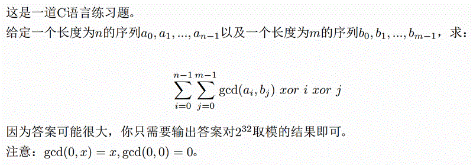

# #4454. C Language Practice

内存限制：24 MiB时间限制：20 Sec

## 题目描述

## 输入格式

第一行输入一个正整数T(T<=85)，表示测试数据的组数。

每组数据第一行包含两个正整数n,m(1<=n,m<=2000)，表示序列的长度。

第二行包含n个正整数，表示a[0],a[1],...,a[n-1](0<=a[i]<=1000000)。

第三行包含m个正整数，表示b[0],b[1],...,b[m-1](0<=b[i]<=1000000)。

## 输出格式

对于每组数据输出一行一个整数，即答案。

## 样例

### 样例输入

    
    3
    3 2
    5 9 6
    3 4
    2 2
    8 9
    0 6
    1 1
    9
    6
    

### 样例输出

    
    6
    22
    3
    
    

## 数据范围与提示

注意：此题只有一个数据点。
