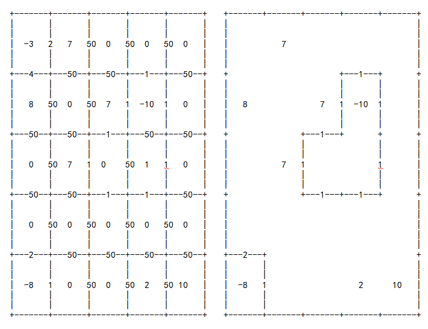

# #4485. [Jsoi2015]圈地

内存限制：512 MiB时间限制：20 Sec

## 题目描述

【故事背景】
JYY在火星买了一大块矩形的地皮做房地产开发。由于地皮实在是太大了，JYY把这块地皮划分成了N行M列的小方格，并在每一格中建造一栋房子。历时若干年，开发终于宣告结束，JYY也可以把这些房子挂牌出售了。现在他找到了两位非同寻常的土豪买家：南南和强强。
麻烦的是，南南和强强是水火不容的。为了保证他们俩不发生矛盾，JYY需要把卖给他们俩的房子用墙隔开。不过造墙是需要钱的，JYY作为倒卖地皮的专家，自然想挣尽可能多的钱，因此他邀请到你帮他设计最优的出售方案。
【问题描述】
JYY把这块地皮划分成了N行M列的矩形，且矩形的每一格中建造一栋房子。现在，南南和强强已经将他们的购买意见提交给了JYY。对于每一栋房子，南南和强强已经给定了他们的出价（不想购买，或愿意以一定价格购买），并且由于他们已经协商好了各自的势力范围，因此不存在两个人同时想买一栋房子的情况。JYY可以选择每一栋房子是否出售（因为不存在两个人同时想买一栋房子的情况，若JYY选择出售一栋房子，它的买家就是确定的）。房子卖给强强和南南以后，JYY就能获得卖出房子出价的总和。
不过，作为售后服务，JYY需要通过造墙（将两栋相邻的房子用一堵墙隔开）把两个人的房子完全隔开。所谓完全隔开，就是指造出的墙以及四周的边界将整个区域划分成若干个不连通的部分，每个部分里面只有一个人的房子。当然，造墙也是需要钱的，而且价格不菲。不过JYY当初在宣传时声称造墙完全免费，所以这部分钱只好由JYY自己出了。
JYY请你为他规划每幢房子是否要卖出以及建造哪些围墙，才能使得卖房子的收益减去造围墙的花费最大。另外一个好消息是整个地皮的四周已经建好了墙，因此JYY可以利用这些建好的墙达到目的。下图就是用墙将区域划分成3个不连通的部分的例子。格子中的数字代表出价（数字的含义参考输入格式），边上的数值代表造墙的价格。四周的墙（边界）本来就有，不需要JYY花额外的代价去建造。&emsp;

## 输入格式

输入第一行包含两个用空格隔开的自然数N和M。
接下来N行，每行M个整数，第i行第j列的整数a描述了位于(i,j)房子的出售信息。如果a=0,说明强强和南南都不想买这个位置上的房子；如果a>0,说明强强想以价格a买这个位置上的房子。如果a<0,说明南南想以价格-a买这个位置上的房子。
接下来N-1行，每行M个整数。第i行,第j列的数表示第i行,第j列的房子与第i+1行，第j列的房子之间的墙的造价。
接下来N行，每行M-1个整数。第i行,第j列的数表示第i行,第j列的房子与第i行，第j+1列的房子之间的墙的造价。
1&le;N,M&le;400，任何价格都不超过1,000

## 输出格式

输出仅有一行包含一个整数，表示JYY的最大收益。

## 样例

### 样例输入

    
    5 5
    -3 7 0 0 0
    8 0 7 -10 0
    0 7 0 1 0
    0 0 0 0 0
    -8 0 0 2 10
    4 50 50 1 50
    50 50 1 9 50
    50 50 1 1 50
    2 50 50 50 50
    2 50 50 50
    50 50 1 1
    50 1 8 1
    50 50 50 50
    1 50 50 50
    

### 样例输出

    
    48
    

## 数据范围与提示
