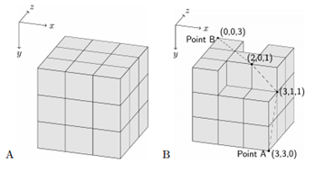

# #4685. Cubic Colonies

内存限制：256 MiB时间限制：90 Sec

## 题目描述

公元3456年，表面积过小的地球再也不足以使得千亿人和平的生活在一起了。Interstellar Colonization Project with Cubes (ICPC)是一个试图将人类转移到太空殖民地来缓解人口压力的项目。ICPC获得了政府的支持，并很快利用低成本的标准立方块零件建立起太空殖民地。

最大的殖民地看起来像一个魔方，它由 3&times;3&times;3 个标准立方块组成（如图A）。小的殖民地（如图B）与最大的殖民地相比则缺失了一些标准立方块。

当我们开始用标准立方块建造殖民地时，我们会从一个简单的标准立方块开始，然后反复地将下一个立方块与已经存在的立方块完美地粘合，每个相贴合的面都会紧紧粘合。

 

然而，就在第一次发射前，我们发现了殖民地的一个设计缺陷。为此对于每个殖民地我们需要添加一根电缆连接殖民地上存在于表面的某两个点，但是短时间内我们无法改变每个标准立方块的内部。因此我们决定在殖民地的表面添加电缆。如果电缆的某一部分不在表面上，则这部分有可能会在发射中被剪断，因此我们必须使电缆完全在表面上。在上图B的虚线就是一个很好的例子。你需要写一个程序，通过给定的殖民地形状和一对在其表面上的点，计算出最短的可能的电缆长度。

第三、四、五组样例如下图A、B、C所示。注意，如果两个表面有公共的交点，则你可以通过这个交点设置电缆。为了便于说明，一些块被部分透明地显示。

## 输入格式

输入包含多组测试数据。每组数据的第一行包含六个整数，前三个整数表示一个在殖民地表面的点，后三个整数表示另一个在殖民地表面的点。保证两个点互不相同，且坐标在0到3之间。

接下来九行，每行三个字符。对于 0&le;i,j,k<3 ，以 (i,j,k)  和 (i+1,j+1,k+1)  为体对角线的标准立方块如果存在，则第 1+j+3k 行的第1+i 个字符是&lsquo;#&rsquo;，否则是&lsquo;.&rsquo;表示这个位置不存在标准立方块。

你可以认为不存在一个不含中心块但含其他块的殖民地，即你不需要考虑内表面的问题。输入以六个零作为结尾。

## 输出格式

对于每组数据，输出一行一个实数表示最短的可能的电缆长度，你的输出与答案的绝对误差不超过0.001时被认为是正确的。你可以认为给定的两个点之间一定可以连接电缆。

## 样例

### 样例输入

    
    0 0 0 3 3 3
    ###
    ###
    ###
    ###
    ###
    ###
    ###
    ###
    ###
    3 3 0 0 0 3
    #..
    ###
    ###
    ###
    ###
    ###
    #.#
    ###
    ###
    0 0 2 2 2 2
    ...
    ...
    ...
    .#.
    #..
    ...
    ##.
    ##.
    ...
    0 1 2 2 1 1
    ...
    ...
    ...
    .#.
    #..
    ...
    ##.
    ##.
    ...
    3 2 0 2 3 2
    ###
    ..#
    ...
    ..#
    ...
    .#.
    ..#
    ..#
    .##
    0 0 0 0 0 0
    

### 样例输出

    
    6.70820393249936941515
    6.47870866461907457534
    2.82842712474619029095
    2.23606797749978980505
    2.82842712474619029095 
    
    

## 数据范围与提示
