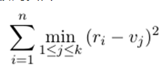

# #4953. [Wf2017]Posterize

内存限制：512 MiB时间限制：4 Sec

## 题目描述

数字图像的像素可以用三个在0到255之间的整数表示,它们分别表示红色、绿色和蓝色的强度。为了压缩图片或是

为了产生艺术效果,许多图像编辑工具收录了如下所述的"色调分离"操作。每个颜色通道会分别考虑,本题只考虑红

色通道的情况。不同于在红色通道使用0到255之间全部的整数,一张色调分离后的图片只会使用这些数字里至多 k 

种整数。每个像素原来的红色强度会被替换成最相近的可用强度。图像编辑工具会选择k个整数来最小化替换过程

引起的平方误差之和。假设原图有n个像素,它们的红色取值是r1,&middot;&middot;&middot;,rn,而 k 种可用整数为v1,&middot;&middot;&middot;,vk ,那

么平方误差之和被定义为

你的任务是计算可以实现的最小平方误差之和,参数k和图片的红色强度会给出。

## 输入格式

第一行包含两个整数d(1&le;d&le;256)和k(1&le;k&le;d)

分别表示原图中不同的红色强度有多少种,色调分离后可以使用的红色强度有多少种。

接下来d行描述了每种红色强度在原图中占据的像素点数量。

每行包含两个整数r(0&le;r&le;255)和p(1&le;p&le;226)

这里r是一种红色强度的取值,而p是这种取值对应的像素点数量。这d行信息按照红色强度取值升序给出。

## 输出格式

输出最优的 k 种可选取值对应的平方误差之和。

## 样例

### 样例输入

    
    样例1
    2 1
    50 20000
    150 10000
    样例2
    2 2
    50 20000
    150 10000
    样例3
    4 2
    0 30000
    25 30000
    50 30000
    255 30000
    

### 样例输出

    
    样例1
    66670000
    样例2
    0
    样例3
    37500000
    

## 数据范围与提示
