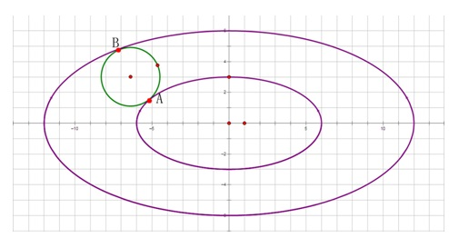

# #5041. LWD的降临

内存限制：256 MiB时间限制：1 Sec

## 题目描述

Background

椭圆是平面内到定点F1、F2的距离之和等于一个定值（大于|F1F2|）的动点P的轨迹，F1、F2称为椭圆的两个焦点

。以下内容均发生在二维平面。DescriptionLWD垂涎YSY星球很久了，他总是幻想着自己有一天能到YSY星球上去生

活。好心的ZWD决定帮他一个忙，用他的宇宙飞船把LWD送上YSY星球。因为ZWD的飞船不能飞得太远，所以飞船只能

绕两个定点作椭圆轨道的飞行。并且因为ZWD还有更重要的事情要做，所以只想沿着YSY星球表面高速掠过，然后把

LWD丢出去。理论上来说，ZWD飞船的椭圆轨道与YSY星球会有两个切点，如下图，有A，B两个切点，所以说ZWD可以

选择在到A点把LWD丢出去或者到B再丢。但是ZWD想让他的椭圆轨道想尽量小，所以他会选择A点。由于ZWD飞船的导

航系统被拿去送给ZWD工作过的飞船驾驶学校作纪念了，所以他想请你帮助他解决导航的问题。现在你知道椭圆轨

道的两个焦点和YSY星球的坐标和半径，请你粗略地告诉ZWD LWD会降落在何处。

## 输入格式

第一行一个整数t，表示数据组数。对与每组数据：

第一行四个实数x1,y1,x2,y2，表示两焦点坐标。

第二行三个实数x0,y0,r，表示YSY星球(在二维平面中是一个圆)的圆心坐标和半径。

t<=500,x,y<=1500,r<=250；

保证一定存在两个可能的切点，即两焦点构成的线段不会与给出的圆相交。

## 输出格式

输出共t行，每行两个整数x,y，表示降落点的坐标。

误差不得超过 0.1（本题设置SPJ）

## 样例

### 样例输入

    
    5
    671.96 709.16 631.66 143.33
    193.97 46.03 9.45
    260.12 443.55 414.69 159.44
    867.06 413.22 145.39
    661.12 270.16 199.50 762.11
    217.73 88.88 143.38
    393.83 682.29 788.82 425.07
    181.08 239.07 104.56
    146.23 889.95 599.49 296.45
    341.26 157.41 26.60
    

### 样例输出

    
    201.87 51.22
    725.78 378.91
    299.74 206.49
    259.56 308.16
    352.26 181.63
    

## 数据范围与提示
