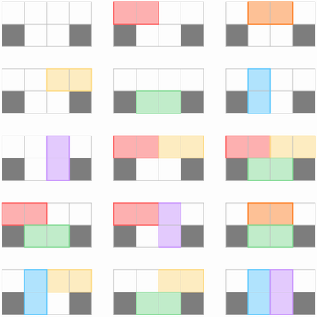

# #5205. [CodePlus 2018 3 月赛]白金元首与莫斯科

内存限制：512 MiB时间限制：20 Sec

## 题目描述

寒冷刺骨的天气、疲惫不堪的军队&hellip;&hellip;包围首都的作战计划陷入了困境。空军或许是拯救战况的最后希望了，元首

Adolf想道。在一个n&times;m的网格区域中存在一个陆军单位需要补给，区域中的每个格子为空地或障碍物中的一种。

航空舰队需要派遣若干运输机前往此区域，每一架运输机可以向两个相邻（有一条公共边）的空地投放物资。为防

止不必要的损坏，一个标记为空地的格子至多只能得到一次投放。由于天气原因，陆军单位所在的确切位置并不能

确定。因此元首想知道，对于每个空地格子，当陆军单位在其中（视作障碍物）时，用若干（可以为0）架运输机

向其余空地投放任意数量的物资的不同方案数。两个投放方案不同，当且仅当存在一个格子在一个方案中被投放而

另一方案中未被投放，或存在两个被投放的格子，在一个方案中被同一架运输机投放而在另一方案中非然。若仍有

疑问，请参考「样例1解释」。

你需要编写程序帮助元首计算这些值。

## 输入格式

第一行包含一个正整数T&mdash;&mdash;数据的组数。

接下来包含T组数据，格式如下，数据间没有空行。

第1行：两个空格分隔的正整数n,m&mdash;网格区域的行数和列数。

接下来n行：其中第i行包含m个空格分隔的整数Ai1,Ai2,&hellip;,Aim&mdash;其中Aij=0表示第iii行第j列的格子为空地；Aij=1表示该格为障碍物。

1&le;n,m&le;17,Aij&isin;{0,1}

## 输出格式

对于每组数据输出n行

第i行包含m个空格分隔的整数Bi1,Bi2,&hellip;,Bim&mdash;若第i行第j列的格子为空地，Bij为该格变为障碍物后投放的方案数；否则Bij=0

## 样例

### 样例输入

    
    2 4
    0 0 0 0
    0 0 0 1
    

### 样例输出

    
    14 13 10 22
    15 11 17 0
    

## 数据范围与提示

以第 2行第 1 列的空地格为例，其变为障碍物后的网格如下图，其中白色格子代表空地，黑色格子代表障碍物。

.png)

15种方案如下图所示，不同颜色代表不同运输机的投放位置

来自 CodePlus 2018 3 月赛，清华大学计算机科学与技术系学生算法与竞赛协会 荣誉出品。

Credit：idea/吕时清　命题/吕时清　验题/吕欣，王聿中

Git Repo：https://git.thusaac.org/publish/CodePlus3

感谢腾讯公司对此次比赛的支持。
