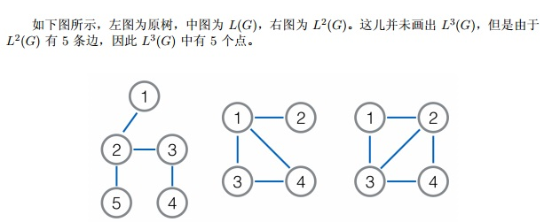

# #5211. [Zjoi2018]线图

内存限制：512 MiB时间限制：30 Sec

## 题目描述

九条可怜是一个热爱出题的女孩子。今天可怜想要出一道和图论相关的题。在一张无向图G上，我们可以对它进行

一些非常有趣的变换，比如说对偶，又或者说取补。这样的操作往往可以赋予一些传统的问题新的活力。例如求补

图的连通性、补图的最短路等等，都是非常有趣的问题。最近可怜知道一种新的变换：求原图的线图(linegraph)

对于无向图G=<V,E>它的线图L(G)也是一个无向图：1:它的点集大小为|E|，每个点唯一对应着原图的一条边。2:两

个点之间有边当且仅当这两个点对应的边在原图上有公共点（注意不会有自环）。下图是一个简单的例子，左图是

原图，右图是它对应的线图。其中点1对应原图的边(1,2)，点2对应(1,4)，点3对应(1,3)，点4对应(3,4)

.png)

经过一些初步的摸索，可怜发现线图的性质要比补图复杂很多，其中突出的一点就是补图的补图会变回原图，而L(

L(G))在绝大部分情况下不等于G，甚至在大多数情况下它的点数和边数会以很快的速度增长。因此，可怜想要从最

简单的入手，即计算Lk(G)的点数（Lk(G)表示对G求k次线图）。然而遗憾的是，即使是这个问题，对可怜来说还是

太困难了，因此她进行了一定的弱化。她给出了一棵n个节点的树T，现在她想让你计算一下Lk(T)的点数。

## 输入格式

第一行输入两个整数n,k，表示树的点数以及连续求线图的次数。

接下来n?1行每行两个整数u,v表示树上的一条边。

2 &le; n &le; 5000

k<=9

## 输出格式

输出一行一个整数，表示答案对998244353取模后的值

## 样例

### 样例输入

    
    5 3
    1 2
    2 3
    2 5
    3 4
    

### 样例输出

    
    5
    

## 数据范围与提示

 
