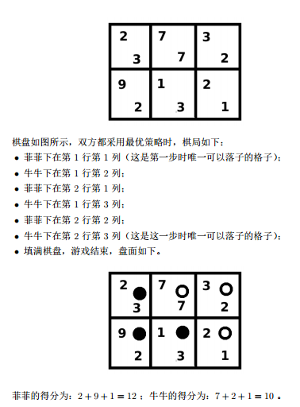

# #5248. [2018多省省队联测]一双木棋

内存限制：512 MiB时间限制：20 Sec

## 题目描述

菲菲和牛牛在一块n行m列的棋盘上下棋，菲菲执黑棋先手，牛牛执白棋后手。棋局开始时，棋盘上没有任何棋子，

两人轮流在格子上落子，直到填满棋盘时结束。落子的规则是：一个格子可以落子当且仅当这个格子内没有棋子且

这个格子的左侧及上方的所有格子内都有棋子。

棋盘的每个格子上，都写有两个非负整数，从上到下第i行中从左到右第j列的格子上的两个整数记作Aij、Bij。在

游戏结束后，菲菲和牛牛会分别计算自己的得分：菲菲的得分是所有有黑棋的格子上的Aij之和，牛牛的得分是所

有有白棋的格子上的Bij的和。

菲菲和牛牛都希望，自己的得分减去对方的得分得到的结果最大。现在他们想知道，在给定的棋盘上，如果双方都

采用最优策略且知道对方会采用最优策略，那么，最终的结果如何

## 输入格式

第一行包含两个正整数n,m，保证n,m&le;10。

接下来n行，每行m个非负整数，按从上到下从左到右的顺序描述每个格子上的

第一个非负整数：其中第i行中第j个数表示Aij。

接下来n行，每行m个非负整数，按从上到下从左到右的顺序描述每个格子上的

第二个非负整数：其中第i行中第j个数表示Bij

n, m &le; 10 ， Aij, Bij &le; 100000

## 输出格式

输出一个整数，表示菲菲的得分减去牛牛的得分的结果。

## 样例

### 样例输入

    
    2 3
    2 7 3
    9 1 2
    3 7 2
    2 3 1
    

### 样例输出

    
    2
    

## 数据范围与提示

 
