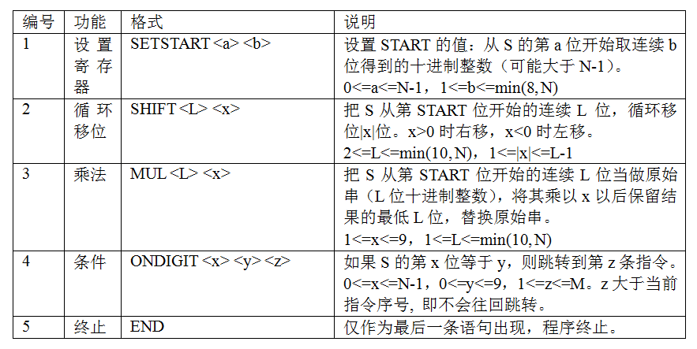

# #5452. [wc2013]彩色项链

内存限制：256 MiB时间限制：10 Sec

## 题目描述

一条项链由N个珠子连接而成，编号依次为0, 1, 2, &hellip;, N-1。每个珠子的颜色用0~9之间的一位数字来表示（因此

，可用的颜色一共有10种）。一条长度为4的项链如下图所示：（圆圈中的数字表示颜色，圆圈旁边的数字为珠子

的编号）

 

.png)

需要注意的是，如图1所示，编号为0, 1, 2, &hellip;, N-1的珠子大小是依次递增的，设编号为i的珠子的颜色值为ai，

则数字序列a0a1&hellip;an-1可以唯一的表示一种项链。例如，图1所示的项链表示为"1337"。

现在有一台自动生产项链的机器，它的结构和工作方式如下所述：

机器的核心控制部件主要包括：一个CPU、一个整数寄存器START、和存储器S。

机器内部固化有一段程序，由CPU解释执行。该程序的输入是长度为N的十进制数字序列A，输出是另一个长度为N的

十进制数字序列B。每次执行程序前将S初始化为输入序列A；程序结束后把S作为输出串B。START初始化为0。

程序包含M条指令，顺序编号为1~M。指令共有5种，以下是指令的格式和功能：（尖括号<>表示指令参数，都是整数）

由于项链是环型的，因此第i位和第i+kN位（k为整数）代表数字序列的同一位置。例如当N=4时，第6位和第2位是等价的。

下面是一个程序的例子：

MUL 3 2

SETSTART 2 1

ONDIGIT 0 4 1

SHIFT 3 -2

END

机器启动的时候，输入一个数字串S0，执行程序得到一个新的数字序列S1并生产出S1代表的项链来，以后机器每生

产出一条新项链Sn，就把Sn对应的数字序列作为输入重新执行一遍程序，得到一个新的数字序列Sn+1并生产出新的

项链。由于长度为N的项链种类数目是有限的（至多10N种不同的项链），因此如果让机器一直工作下去，某些种类

的项链会被生产出无限多条。编程计算出这些将被无限生产出的项链有多少种。在本题中，可以被生产出来的项链

种类总数保证不超过10^6。

## 输入格式

第1行包含两个整数N和M (1<=N<=100,000，2<=M<=30)，

第2行包含一个有N个数字的串S0。

第3行到第M+2行为一段程序，每行一条指令，程序保证无错，行末和行首均没有空格。

## 输出格式

仅有一行，包含一个整数，是将被无限生产出来的项链种类数目。

## 样例

### 样例输入

    
    4 5
    1234
    MUL 3 2
    SETSTART 2 1
    ONDIGIT 0 4 1
    SHIFT 3 –2
    END
    

### 样例输出

    
    8
    //该样例对应于题目描述中给出的示例程序。前29次生产出来的项链是：
    4426  4886  6796  8356  0676  4136  6286  6526  4306  0866 
    6712  2432  4882  2796  8556  0716  6412  2822  4562  2192 
    2786  6556  0316  6602  0322  4062  2182  4382  2786…
    可以看出，从2786开始机器陷入了循环，因此从2786开始的8条项链将被无限制的生产出来。
    

## 数据范围与提示
