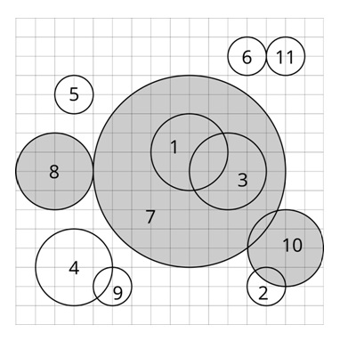

# #5465. [APIO 2018] 选圆圈

内存限制：512 MiB时间限制：20 Sec

## 题目描述

在平面上，有 n 个圆，记为 c_1, c_2, \ldots, c_n 。我们尝试对这些圆运行这个算法：  

1. 找到这些圆中半径最大的。如果有多个半径最大的圆，选择编号最小的。记为 c_i 。  

2. 删除 ci 及与其有交集的所有圆。两个圆有交集当且仅当平面上存在一个点，这个点同时在这两个圆的圆周上或圆内。

（如果平面上存在一个点被这两个圆所包含，我们称这两个圆有交集。一个点被一个圆包含当且仅当它位于圆内或圆周上。）  

3. 重复上面两个步骤直到所有的圆都被删除。

 

当 ci 被删除时，若循环中第1步选择的圆是 cj ，我们说 ci 被 cj 删除。对于每个圆，求出它是被哪一个圆删除的。

## 输入格式

第一行包含一个整数n，表示开始时平面上圆的数量，

接下来n行，每行包含三个整数xi,yi,ri，描述圆ci圆心的xy坐标和它的半径。

-1e9<=xi,yi<=1e9, 1<=ri<=1e9

1<=n<=3e5

## 输出格式

输出一行，包含n个整数a1,a2,&hellip;,an，其中a_i表示圆c_i是被圆c_ai删除的。

## 样例

### 样例输入

    
    11
    9 9 2
    13 2 1
    11 8 2
    3 3 2
    3 12 1
    12 14 1
    9 8 5
    2 8 2
    5 2 1
    14 4 2
    14 14 1
    

### 样例输出

    
    7 2 7 4 5 6 7 7 4 7 6
    //题目描述中的图片对应了样例中的情形。
    
    
    

## 数据范围与提示
